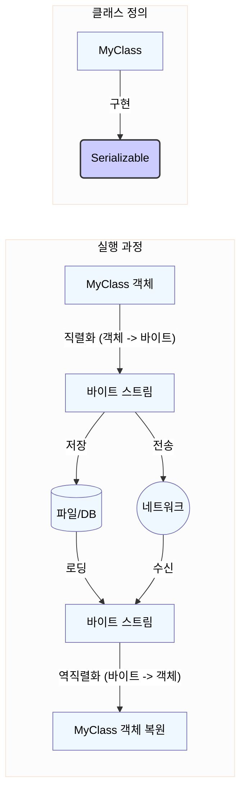
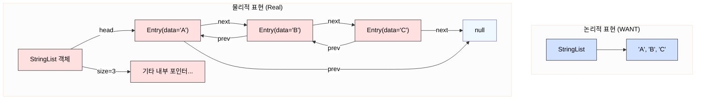
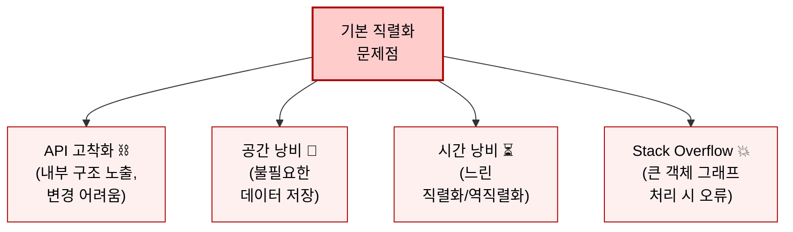
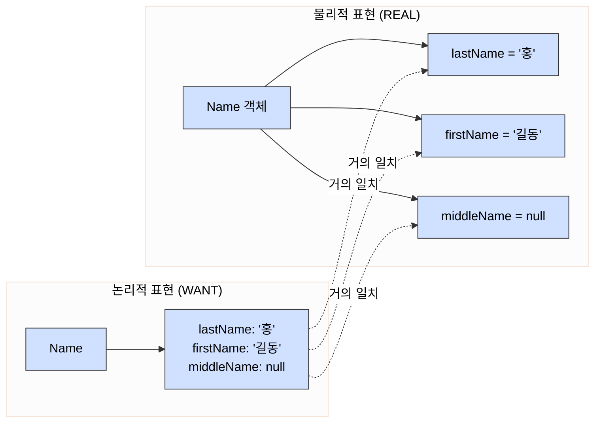
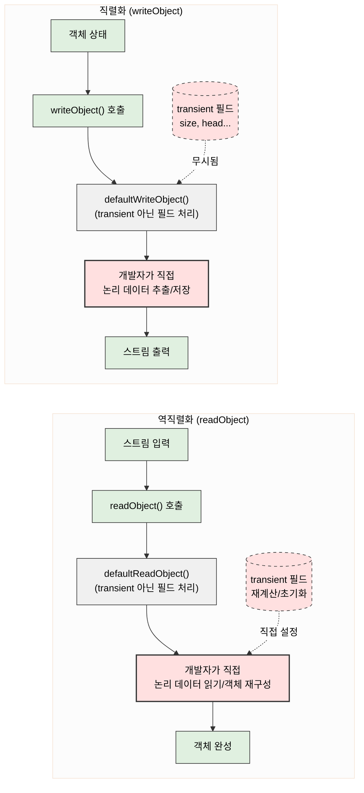
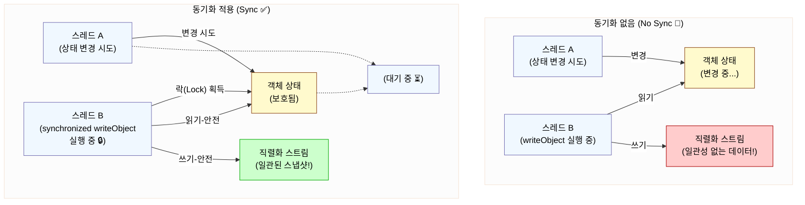

# 87. 커스텀 직렬화 형태를 고려해보라

## 0. 시작 하기 전, `Serializable` 핵심 요약



### 핵심 포인트

* **정체:**
  * 자바의 '표식' 인터페이스 (`java.io.Serializable`)
  * 구현할 메소드는 없음
* **목적:** 특정 클래스의 객체를 **저장(파일/DB)** 하거나 **전송(네트워크)** 가능하게 만듦.
* **작동 방식:**
  * **직렬화(Serialization):** 객체의 현재 상태(데이터) -> 바이트 스트림(byte stream) 변환
  * **역직렬화(Deserialization):** 바이트 스트림 -> 원래 객체 상태로 복원
*   **사용법:** 클래스 선언부에 `implements Serializable` 추가

    ```java
    public class MyData implements Serializable {
        // ... 클래스 내용 ...
    }
    ```
* **주요 용도:**
  * 데이터 **영속화**: 프로그램 종료 후에도 데이터 보존
    * (예: 게임 저장)
  * **네트워크 통신**: 원격 시스템 간 객체 전달
    * (예: 채팅 메시지 객체 전송)
  * **캐싱**: 자주 쓰는 객체를 저장해두고 빠르게 재사용
* **`serialVersionUID`:** 클래스 버전 관리용 고유 번호. 직렬화/역직렬화 시 이 번호가 일치하는지 확인하여 호환성 체크 (매우 중요)
* **주의:** 그냥 `implements Serializable`만 쓰면(기본 직렬화) 나중에 클래스 내부를 수정했을 때 저장된 객체를 못 읽는 문제가 생길 수 있음 (유지보수 어려움)
* **대안:** JSON, XML, Protocol Buffers 등 다른 데이터 저장/전송 방식도 많이 사용됨.

\
\


***

## 1. 왜 기본 직렬화는 위험할 수 있는가? 🤔

### **핵심 문제**: 기본 직렬화는 객체의 **논리적 데이터**가 아닌, **물리적 표현**을 그대로 저장.

\


```java
// 코드 87-2 기본 직렬화 형태에 접합하지 않은 클래스
public final class StringList implements Serializble {
    private int size = 0;
    private Entry head = null;

    private static class Entry implements Serialzible {
        String data;
        Entry next;
        Entry previous;
    }

    ...// 나머지 코드는 생략
}
```



\


### **발생 가능한 문제점들**



\
\


### 1. **API 고착화**

* 클래스 내부 구현(private 필드, 내부 클래스 구조 등)이 직렬화 형태에 포함되어 공개 API처럼 되어버림
* 향후 내부 리팩토링이 매우 어려워짐 (`StringList`의 `Entry` 클래스 예시)

### 2. **성능 저하 (공간)**

* 불필요한 내부 데이터(예: 연결 리스트의 포인터)까지 저장 -> 비효율적 직렬화된 크기

### 3. **성능 저하 (시간)**

* 복잡한 객체 그래프를 그대로 탐색 -> 직렬화/역직렬화 속도 저하

### 4. **StackOverflowError 위험**

* 객체 그래프가 깊거나 크면 재귀적인 직렬화 과정에서 스택 오버플로 발생 가능

### 5. **정확성 문제**

* 객체의 불변식이 내부 구현 방식에 의존하는 경우, 기본 직렬화/역직렬화 후 객체가 비정상 상태 유발
  * 예: Hashtable의 해시 버킷 위치

\


### **기억하세요**

> `Serializable`을 구현하고 기본 직렬화를 사용하면, 그 클래스의 **현재 내부 구현**에 **영원히** 묶일 수 있습니다.

\
\


***

## 2. 그렇다면, 언제 기본 직렬화를 써도 괜찮을까? ✅

\


### **황금률:** 객체의 **논리적 내용**과 **물리적 표현(필드)** 이 **거의 동일**할 때만 사용을 고려합니다.

* _예시:_ `Name` 클래스 (`lastName`, `firstName`, `middleName` 필드가 곧 논리적 데이터)

```java
// 코드 87-1: 기본 직렬화 형태에 적합한 후보 (개념)
public class Name implements Serializable {
    private final String lastName;
    private final String firstName;
    private final String middleName;
    // ... 생성자, 메서드 등 ...
}
```



### **주의:** 기본 직렬화가 적합해 보여도, 역직렬화 시 **데이터 유효성 검사**나 **불변식 보장**을 위해 `readObject` 메서드가 필요할 수 있습니다.

* 예: `Name` 필드가 `null`이 아님을 보장

\
\


***

## 3. 해결책: 커스텀 직렬화 (writeObject/readObject) 💡



### **목표:** 객체의 **논리적인 데이터**만 효율적으로 저장하고 복원

### **핵심 도구:**

#### `transient` 키워드:

* 기본 직렬화 과정에서 **제외할 필드**에 표시
* _언제 사용?_
  * 다른 필드에서 유도되는 값 (캐시 등)
  * 논리적 상태와 무관한 필드 (네이티브 리소스 포인터 등)
  * 커스텀 직렬화 시 저장하지 않을 내부 구현 필드

#### `private void writeObject(ObjectOutputStream out) throws IOException;`

* 객체를 어떻게 스트림에 쓸지 직접 정의
* **필수:** `out.defaultWriteObject();` 를 **먼저 호출** (미래 호환성 위해)
* 논리적 데이터만 순서대로 `out.writeInt()`, `out.writeObject()` 등으로 저장

#### `private void readObject(ObjectInputStream in) throws IOException, ClassNotFoundException;`

* 스트림에서 데이터를 읽어 객체를 어떻게 복원할지 직접 정의
* **필수:** `in.defaultReadObject();` 를 **먼저 호출** (미래 호환성 위해)
* `writeObject`에서 저장한 순서대로 데이터를 읽어 객체 상태를 재구성
* `transient` 필드나 계산된 필드를 여기서 초기화/복원해야 할 수 있습니다.

### **개념 예시 (StringList):**

```java
public final class StringList implements Serializable {
    private transient int size = 0;
    private transient Entry head = null;

    // Entry 클래스는 이제 Serializable 불필요

    /**
    * @serialData 리스트 크기(int) 후, 모든 문자열 원소(String) 순서대로 기록.
    */
    private void writeObject(ObjectOutputStream s) throws IOException {
        s.defaultWriteObject();
        s.writeInt(size);      // 논리적 데이터: 크기 저장
        for (Entry e = head; e != null; e = e.next)
            s.writeObject(e.data); // 논리적 데이터: 문자열 원소들 저장
    }

    private void readObject(ObjectInputStream s) throws IOException, ClassNotFoundException {
        s.defaultReadObject();
        int numElements = s.readInt(); // 크기 읽기
        for (int i = 0; i < numElements; i++)
            add((String) s.readObject()); // 원소 읽어서 리스트 재구성 (add 메서드 활용)
    }
    // ... add() 및 다른 메서드 생략 ...
}
```

### **장점:** 유연성 확보, 성능(공간/시간) 향상, 안정성 증가(스택 오버플로 방지)

\
\


***

## 4. 직렬화 시 반드시 지켜야 할 것들! 📌

### 1. **`serialVersionUID`를 명시적으로 선언하세요!**

```mermaid
%%{init: {'theme': 'base', 'themeVariables': { 'primaryColor': '#f0f8ff', 'primaryTextColor': '#000', 'primaryBorderColor': '#7570b3', 'lineColor': '#333', 'edgeLabelBackground':'#fff', 'clusterBkg': '#fcfcfc'}}}%%
graph TD
    subgraph "시나리오3-UID 명시-호환 차단"
        C5["클래스 V1<br>(UID=123L)"] --> SD3["직렬화된 데이터 V1<br>(UID=123L 포함)"];
        C6["클래스 V3<br>(V1과 호환X,<br>UID=789L **명시/변경**)<br>(UID=789L)"];
        C6 --->|UID 불일치!| SD3;
        X3["💥 InvalidClassException<br>(의도된 차단)"]
        SD3 --> X3
        style X3 fill:#ffcccc,stroke:#a00
    end

    subgraph "시나리오2-UID 명시-호환 유지"
        C3["클래스 V1<br>(자동 UID=123L)"] --> SD2["직렬화된 데이터 V1<br>(UID=123L 포함)"];
        C4["클래스 V2<br>(V1 변경, UID=123L **명시**)<br>(UID=123L 유지)"];
        C4 --->|UID 일치!| SD2;
        X2["✅ 읽기 성공<br>(readObject에서<br>변경 처리 필요)"]
        SD2 --> X2
        style X2 fill:#ccffcc,stroke:#0a0
    end

    subgraph "시나리오1-UID 명시X"
        C1["클래스 V1<br>(자동 UID=123L)"] --> SD1["직렬화된 데이터 V1<br>(UID=123L 포함)"];
        C2["클래스 V2<br>(V1 변경, UID 명시X)<br>(자동 UID=456L)"];
        C2 --->|UID 불일치!| SD1;
        X1["💥 InvalidClassException"]
        SD1 --> X1;
        style X1 fill:#ffcccc,stroke:#a00
    end

    style C1 fill:#f0f8ff,stroke:#7570b3
    style SD1 fill:#fffacd,stroke:#8B4513
    style C2 fill:#f0f8ff,stroke:#7570b3
    style C3 fill:#f0f8ff,stroke:#7570b3
    style SD2 fill:#fffacd,stroke:#8B4513
    style C4 fill:#f0f8ff,stroke:#7570b3
    style C5 fill:#f0f8ff,stroke:#7570b3
    style SD3 fill:#fffacd,stroke:#8B4513
    style C6 fill:#f0f8ff,stroke:#7570b3
```



#### **왜?**

* 호환성 문제 예방 (클래스 변경 시 UID 자동 계산 변경 방지), 약간의 성능 향상

#### **어떻게?**

* `private static final long serialVersionUID = <고유한 long 값>;`
* 새 클래스는 아무 값, 기존 클래스는 `serialver`로 확인한 이전 값 사용 권장

#### **언제 변경?**

* **오직** 구버전과의 호환성을 **의도적으로** 끊고 싶을 때만! (이 외에는 절대 변경 금지)

### 2. **`transient` 필드 초기화를 신경 쓰세요.**

* 역직렬화 시 `transient` 필드는 기본값(null, 0, false)으로 시작
* `readObject`에서 직접 값을 설정하거나, 지연 초기화(Lazy Initialization)를 사용

### 3. **동기화를 고려하세요.**



* 클래스가 스레드 안전성을 위해 `synchronized` 등을 사용한다면, `writeObject` 메서드도 **반드시** 동일한 동기화 전략
  * 예: `synchronized` 키워드 추가
  * 데이터 일관성 및 교착 상태 방지를 위함

### 4. **직렬화 형태를 문서화하세요.**

* 기본 직렬화 필드: `@serial` Javadoc 태그 사용
* 커스텀 직렬화 형식/메서드: `@serialData` Javadoc 태그 사용. (어떤 순서로 무엇을 저장/읽는지 설명)

\


***

## 5. 핵심 정리 ✨

* 클래스를 `Serializable`로 만들기로 했다면, **어떤 직렬화 형태를 사용할지 신중하게 설계**해야
* **기본 직렬화**는 객체의 논리적/물리적 표현이 거의 일치하는 **매우 단순한 경우**에만 고려
* 대부분의 경우, **커스텀 직렬화(`writeObject`/`readObject`)** 가 유연성, 성능, 안정성 면에서 더 나은 선택
* 직렬화 형태는 **클래스의 공개 API**와 같고, 한번 배포되면 변경하기 매우 어려우니, 설계에 충분한 시간을 투자
