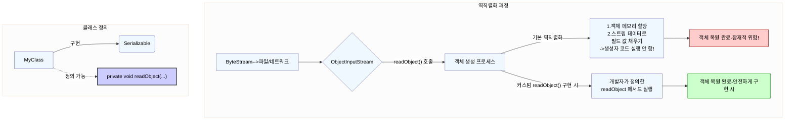
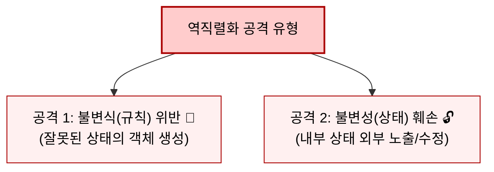
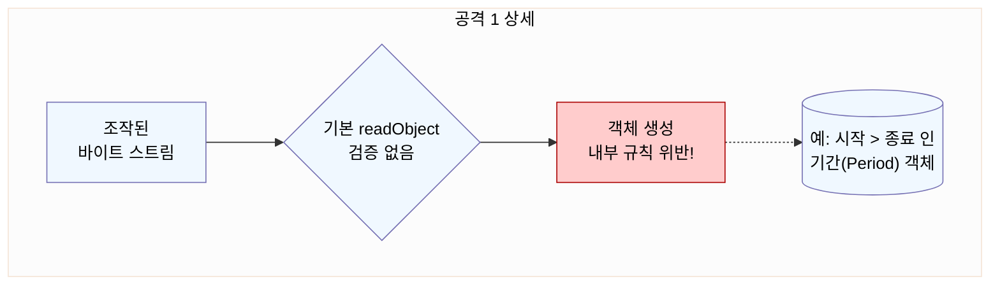
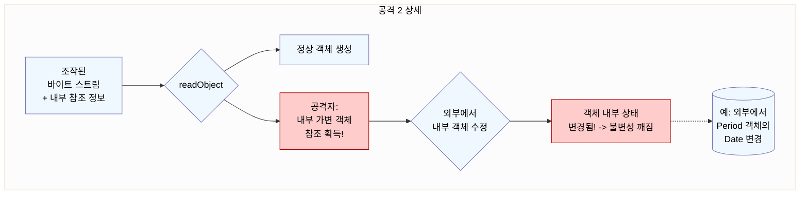
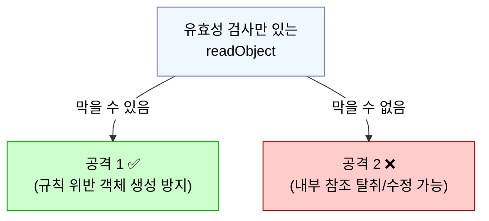
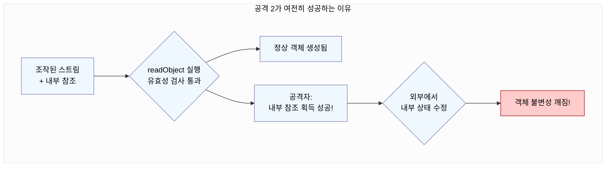
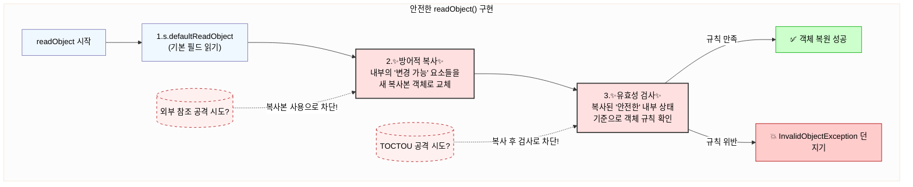
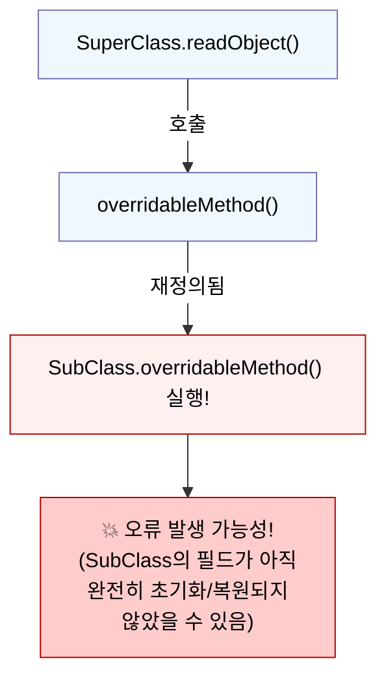

# Item 88: readObject 메서드는 방어적으로 작성하라

## 0 시작 하기 전, `readObject`와 역직렬화 핵심 요약



### 핵심 포인트

- **`readObject`의 역할**

  - 역직렬화 과정에서 바이트 스트림으로부터 객체의 상태를 읽어와 메모리에 객체를 **재구성(생성)** 하는 핵심 메커니즘

- **기본 동작:**

  - 개발자가 `readObject` 메서드를 따로 정의하지 않으면, 자바는 '기본 역직렬화' 수행

  - 객체 메모리 할당 후, 스트림에 저장된 필드 값을 해당 필드에 **직접** 채워 넣음
  - **매우 중요:** 이 과정에서 **클래스의 생성자는 호출되지 않음!**

- **커스텀 `readObject`**

  - 클래스 내에 `private void readObject(ObjectInputStream in)` 메서드를 정의하면, 기본 역직렬화 대신 이 메서드가 호출됨.

  - 개발자가 객체 복원 과정을 직접 제어 가능.

- **문제의 근원**

  - 기본 역직렬화는 생성자를 거치지 않으므로, 생성자에 구현된 **유효성 검사나 방어 로직이 적용되지 않음.**

  - 이것이 Item 88에서 다루는 보안 취약점의 시작점.

<br><br>

---

## 1. 왜 `readObject`는 방어적으로 작성해야 하는가? 🤔 (기본 역직렬화의 위험성)

### **핵심 문제**: 역직렬화는 객체 생성의 '다른 경로'이며, 기본적으로 **생성자의 안전장치를 우회**

<br>

> **직렬화는 생성자를 '건너뛰는' 문**

#### 정상적인 입주(객체 생성) 절차

- 우리가 집(객체)을 지을 때, 보통 정문(생성자)을 통해 들어가면서 필요한 검사(유효성 검사)를 하고, 중요한 물건(내부 데이터)은 안전하게 보관(방어적 복사)하는 규칙을 정해 놓습니다

#### 특별한 '뒷문'(`readObject` 메커니즘)을 사용

- 그런데 파일이나 네트워크로부터 직렬화된 데이터를 통해 집을 '복구'(역직렬화)할 때는, 정문(생성자)을 사용하지 않습니다.

- 대신, 설계도(직렬화된 데이터)를 보고 직접 가구(필드 값)를 배치하는 특별한 '뒷문'을 사용하는 것과 같습니다.

#### **바로 이 점이 문제**

- 뒷문으로 들어오면 정문에서 하던 검사나 안전 조치를 거치지 않게 됨.

- 따라서 생성자에 아무리 튼튼한 안전장치를 마련했더라도, 역직렬화라는 경로를 통해 들어오면 이 장치들이 작동하지 않아 위험에 노출

<br>

### **발생 가능한 공격 유형 (뒷문으로 들어오는 위험)**







<br>

### 1. **공격 1: 불변식(Invariant) 깨뜨리기**

#### **원리**

- 공격자가 **객체가 내부적으로 지켜야 하는 데이터 일관성 규칙**을 위반하는 '설계도'(바이트 스트림)를 의도적으로 제시
  - 예: 특정 숫자 필드는 양수여야 한다, 어떤 컬렉션은 비어있으면 안 된다 등 클래스 설계 시 정의된 제약 조건

#### **결과**

- '뒷문'(`readObject`)은 정문의 검사(생성자 유효성 검사)를 수행하지 않음

- **정상적인 정문(생성자)으로는 만들 수 없는, 규칙 위반 상태의 '잘못 지어진 집'(객체)** 가 만들어짐.

<br>

### 2. **공격 2: 불변성(Immutability) 깨뜨리기**

#### **원리:**

1.  집(객체) 내부에 **외부인이 만지면 안 되는, 내용 변경이 가능한 중요한 물건**(예: `private` 필드인 `List`, `Map`, `Date` 객체 등)이 있다고 가정.

2.  공격자가 정상 '설계도'(바이트 스트림) 뒤에, 이 **내부의 변경 가능 물건**을 직접 가리키는 **'열쇠 복제 정보'(특별한 참조 데이터)** 추가.

3.  조작된 설계도로 집을 복구(역직렬화).

#### **결과:**

1.  집(객체) 자체는 겉보기에 정상적으로 복구됨.

2.  하지만 공격자는 '열쇠 복제 정보'(추가 데이터)를 이용해, **집 내부의 변경 가능 물건에 대한 '복제 열쇠'(직접적인 참조)** 를 획득.

3.  공격자는 이 복제 열쇠로 **외부에서 집 내부 물건의 상태를 임의로 변경 가능.** → **'안전하게 보관되어야 할' 내부 상태가 외부에서 변경되거나, '불변'으로 설계된 객체가 사실은 변할 수 있게 됨\!**

### **기억하세요**

> `Serializable` 객체의 역직렬화는 **신뢰할 수 없는 데이터**로부터 객체를 생성하는 과정일 수 있습니다. `readObject`는 이 과정의 **최종 방어선**입니다.

<br>
<br>

---

## 2. 미흡한 해결책: 유효성 검사만으로는 부족하다\! 🤔

### **시도:** `readObject` 메서드를 구현하여 `defaultReadObject()` 호출 후, 생성자처럼 유효성 검사 로직만 추가.

```java
// 개념 코드 (Code 88-3 스타일)
private void readObject(ObjectInputStream s) throws IOException, ClassNotFoundException {
    s.defaultReadObject(); // 필드 값 읽기

    // 객체 내부 규칙 검사 (예: 시간 순서)
    if (!isStateValid()) { // isStateValid()는 내부 규칙 검사 메서드라 가정
        throw new InvalidObjectException("객체 상태 규칙 위반!");
    }
    // 방어적 복사가 없음!
}
```

### **문제점:**





### **공격 1(규칙 위반 객체 생성)은 방어 가능**

- 객체가 생성된 후 상태를 검사하여 규칙 위반 시 예외를 던지므로, 잘못된 상태의 객체가 외부에 노출되는 것을 막을 수 있습니다.

### **공격 2(내부 상태 변경)는 방어 불가**

- 객체 생성 시점의 상태는 유효하더라도, 공격자는 여전히 객체 내부의 변경 가능한 요소에 대한 참조(`복제 열쇠`)를 획득할 수 있습니다. 이 참조를 통해 나중에 객체 내부 상태를 변경하는 것을 막지 못합니다.

<br><br>

---

## 3. 해결책: 방어적인 `readObject` 구현 (3단계) 💡

### **목표:** 어떤 종류의 바이트 스트림이 오더라도 객체의 불변식(규칙) 과 불변성(상태)을 모두 지키는 것.

### **핵심 전략:** "일단 읽고 → 내부 보호(복사) → 최종 확인(검증)"



### **구현 단계:**

### 1. **`s.defaultReadObject();` 호출 (1단계: 읽기):**

- 먼저 스트림에서 데이터를 읽어 `transient`가 아닌 필드들 채우기

- 이 시점의 객체 참조 필드는 외부와 공유될 수 있는 잠재적 위험 상태일 수 있음
  - 특히 변경 가능한 타입

### 2. **내부 '변경 가능(Mutable)' 필드 방어적 복사 (2단계: 보호):**

#### **핵심!**

- `defaultReadObject`로 읽어온 필드 중, 내용 변경이 가능한 타입의 객체들은 **반드시 새로운 복사본 객체**를 만들어 해당 필드에 **다시 할당**

  - 변경 가능 타입 객체 예시: `Date`, `ArrayList`, 직접 만든 가변 클래스 등

- `myMutableField = new MyMutableType(myMutableField); // 또는 복사 생성자/메서드 사용`

#### **이유**

- 공격자가 원본 객체의 참조(`복제 열쇠`)를 훔쳤더라도, 우리 객체 내부는 이제 안전한 복사본을 사용하므로 외부의 수정 시도로부터 안전해집니다. 외부와의 참조 공유 고리를 끊는 효과\!

#### **주의**

- 이 재할당을 위해 해당 필드는 `final` 키워드를 가질 수 없습니다. 이는 직렬화 보안을 위한 어쩔 수 없는 트레이드오프입니다.

### 3. **객체 상태 유효성 검사 (3단계: 확인):**

- **방어적으로 복사된**, 이제는 안전하다고 확신할 수 있는 내부 필드들을 대상으로 객체가 지켜야 할 모든 내부 규칙(불변식)을 검사합니다.

  <!-- end list -->

- `if (!isStateValid()) throw new InvalidObjectException(...);`

  <!-- end list -->

- **이유:**
  - 조작되지 않은, 신뢰할 수 있는 내부 상태를 기준으로 규칙을 검증합니다.
  - 방어적 복사 **후에** 검사를 수행해야 검사 시점과 사용 시점 사이의 상태 변경(Time-of-check to time-of-use, TOCTOU) 공격을 방지할 수 있습니다.

### **개념 예시 (방어적 `readObject`):**

```java
public final class SecureDataHolder implements Serializable {
    private transient MutableComponent internalState; // 변경 가능한 내부 요소
    private transient int cachedValue; // 계산된 값

    // 생성자 등은 내부 규칙과 불변성을 보장하도록 구현 가정...

    private void readObject(ObjectInputStream s) throws IOException, ClassNotFoundException {
        // 1단계: 읽기
        s.defaultReadObject();

        // 2단계: 보호 (방어적 복사)
        // - 스트림에서 읽어온 internalState 데이터를 기반으로 새 복사본 생성
        // - 실제로는 s.readObject() 등으로 읽고 복사해야 할 수 있음 (Item 87 내용 참고)
        // - 여기서는 개념적 표현:
        internalState = createDefensiveCopy(internalState); // 반드시 필요!

        // 3단계: 확인 (유효성 검사)
        if (!isValid(internalState)) { // 내부 규칙 검사
            throw new InvalidObjectException("내부 상태 규칙 위반!");
        }

        // 추가: transient 필드 복원 (필요시)
        cachedValue = calculateValue(internalState);
    }

    // 방어적 복사 및 유효성 검사, 계산 메서드는 별도 구현 가정
    private MutableComponent createDefensiveCopy(MutableComponent original) { /*...*/ return new MutableComponent(original); }
    private boolean isValid(MutableComponent state) { /*...*/ return true; }
    private int calculateValue(MutableComponent state) { /*...*/ return 0; }

    // writeObject도 방어적으로 작성 필요 (Item 87)
    // ... 나머지 코드 ...
}
```

### **장점:** 악의적인 바이트 스트림 공격으로부터 객체의 규칙과 상태를 안전하게 보호 가능.

<br><br>

---

## 4. `readObject` 작성 시 반드시 지켜야 할 것들\! 📌

### 1. **`readObject`는 `private`으로 선언하세요.**

- 외부에서 직접 호출할 수 없도록

- 직렬화 시스템만 호출 가능

### 2. **어떤 바이트 스트림이든 처리 가능하게 만드세요.**

- 입력 스트림은 비정상 직렬화 데이터일 수도?

- 공격 가능성을 염두

### 3. **모든 '변경 가능(Mutable)' 내부 필드는 방어적으로 복사하세요.** ✨

- 역직렬화 시 외부와 내부 상태의 연결 고리를 끊는 가장 중요한 단계
- 해당 필드는 `final`일 수 없음

### 4. **유효성 검사는 방어적 복사 '이후'에 수행하세요.** ✨

- 안전한 내부 상태를 대상으로 검사, TOCTOU 공격을 방지
- 규칙 위반 시 `InvalidObjectException`을 던져 객체 생성을 중단

### 5. **`readObject` 내에서 재정의 가능한(Overridable) 메서드를 호출하지 마세요\!** 🚫



#### **이유**

- `readObject`가 실행되는 시점에는 객체, 특히 하위 클래스의 불완전 복원 상태 가능성

- 이때 하위 클래스에서 재정의된 메서드가 호출되면, 불완전한 상태의 로직을 수행하려다 예기치 않은 오류나 상태 불일치 유발 가능 (Item 19 원칙과 동일)

### 6. **모든 필드를 직접 읽고 유효성을 검사해야 한다면 `defaultReadObject`를 호출하지 않을 수도 있습니다.**

- 하지만 `defaultReadObject`를 호출하는 것이 일반적으로 미래의 클래스 변경에 더 유연하게 대처할 수 있음
  - 필드 추가 등

### 7. **`ObjectInputValidation` 인터페이스 사용을 고려하세요.**

- 개별 객체의 유효성뿐 아니라, 역직렬화된 객체 그래프 전체의 일관성이나 유효성을 검증해야 할 때 유용

<br>

---

## 5. 핵심 정리 ✨

- `Serializable`을 구현한 클래스의 **역직렬화 과정(`readObject`)** 은 **생성자와 동등하거나 그 이상의 주의**가 필요한 **객체 생성 경로**

- **기본 역직렬화는 생성자의 안전장치를 거치지 않으므로**, 악의적인 바이트 스트림에 의해 **객체 규칙이 깨지거나 내부 상태가 외부에서 조작**될 수 있음.

- 안전한 역직렬화를 위해 **커스텀 `readObject`** 를 구현하여, **내부의 변경 가능 요소는 반드시 방어적으로 복사**하고, **모든 객체 규칙(불변식)을 복사 이후에 검증**.

- `readObject` 내에서는 **재정의 가능 메서드 호출을 피하기**

- `readObject`를 작성하는 것은 **방어적 프로그래밍**의 중요한 실천 -> **절대 입력을 신뢰하지 않기.**
