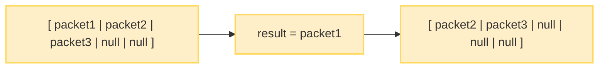

# 📘 이펙티브 자바 스터디

## 📝 아이템 7: 다 쓴 객체 참조를 해제하라

### 🔹 요약

✅ GC(가비지 컬렉터)가 자동으로 메모리를 회수하지만, 여전히 메모리 누수가 발생할 수 있음  
✅ 다 쓴 객체의 참조를 명시적으로 해제해야 함  
✅ 메모리 누수를 방지하기 위한 주요 전략:

- `null` 할당을 통한 참조 해제
- 스코프 축소
- `WeakReference` 활용
- `try-with-resources` 사용

### 🔹 주의사항

📌 **필요없는 객체를 볼 때마다 `null`로 설정하라는 의미가 아님**  
📌 **래퍼런스를 가리키는 변수를 특정한 스코프 안에서 사용한다면 그럴 필요가 없다.** (로컬 변수는 스코프가 넘어가면 정리가 되기 때문)  
📌 **언제 `null`로 설정해야 되는가?** 메모리를 직접 관리하는 클래스에서

---

### 📚 추가 개념

💡 **Java의 메모리 모델**

 <p align="center">
   
 </p>

- Java 프로그램은 메모리에서 실행되는 객체들을 관리하는 데, **힙(Heap)**과 **스택(Stack)** 메모리 두 가지 주요 영역을 사용합니다.
  - **힙(Heap)**: 객체가 동적으로 할당되는 공간으로, JVM에서 가비지 컬렉터(GC)가 이 공간을 관리합니다.
  - **스택(Stack)**: 메서드 호출 시 생성되는 로컬 변수들이 저장되는 공간으로, 메서드가 종료되면 자동으로 메모리가 해제됩니다.

#### 🔑 **메모리 관리의 중요성**

- 객체를 효율적으로 관리하지 않으면 **메모리 누수(Memory Leak)**가 발생할 수 있습니다. 객체가 더 이상 사용되지 않지만 여전히 참조되고 있으면, 가비지 컬렉터가 해당 객체를 회수할 수 없습니다.

#### 💡 **GC(가비지 컬렉터)란?**

 <p align="center">
   
 </p>

- **가비지 컬렉터(GC)**는 자바 프로그램이 실행되는 동안 더 이상 사용되지 않는 객체들을 자동으로 메모리에서 회수하는 역할을 합니다. GC는 JVM에 내장되어 있으며, 메모리를 자동으로 관리합니다.
- GC의 주요 작업은 **마크-스윕(Mark-Sweep)** 알고리즘을 사용하여 불필요한 객체들을 찾아 제거하는 것입니다.

#### 📌 **마크-스윕(Mark-Sweep)이란?**

1. 마크(Mark) 단계: 루트 객체부터 시작하여 모든 도달 가능한 객체를 찾아 마크
2. 스윕(Sweep) 단계: 힙 메모리를 검사하고, 마크되지 않은 객체들을 해제

   **장점**

   - **순환 참조 문제 해결**: 서로 참조하는 객체들이 있어도 가비지 컬렉터가 이를 처리할 수 있습니다.
   - **메모리 단편화 방지**: 주기적으로 힙 메모리를 청소하면서 메모리 단편화(fragmentation)를 줄일 수 있습니다.

   **단점**

   - **성능 저하**: 전체 힙을 검사해야 하므로 **일시적인 성능 저하**가 발생할 수 있습니다.

#### 💡 **GC와 메모리 누수**

- GC가 자동으로 메모리 관리하지만, **강한 참조**를 통해 여전히 객체가 메모리에서 해제되지 않으면 **메모리 누수**가 발생할 수 있습니다. 이때 `null`로 참조를 해제하거나 **약한 참조(WeakReference)**를 사용하는 것이 유용합니다.

#### 💡 **WeakReference란?**

- **WeakReference**는 객체에 대한 **약한 참조**를 제공하는 클래스로, 해당 객체가 **가비지 컬렉터**의 대상이 되도록 합니다. 즉, **강한 참조가 없으면** 해당 객체는 `GC`에 의해 회수될 수 있습니다.
- **WeakReference**는 **캐시**나 **메모리 최적화**와 같은 작업에서 자주 사용됩니다. 예를 들어, 캐시된 객체가 더 이상 필요하지 않으면 가비지 컬렉터가 이를 회수할 수 있고 **메모리가 부족하거나 최적화가 필요하다면 `GC`가 알아서 객체를 회수할 수 있습니다.**

#### 💡 **[WeakHashMap](https://www.geeksforgeeks.org/java-util-weakhashmap-class-java/)이란?**

- **WeakHashMap**은 키를 `WeakReference`로 저장하는 `Map`으로,  
  키에 대한 강한 참조가 사라지면 `GC(Garbage Collector)`가 자동으로 해당 엔트리를 제거합니다.
- 일반적인 `HashMap`은 키와 값이 **강한 참조(Strong Reference)로 저장**되므로,  
  키를 참조하는 한 `GC`가 제거하지 않습니다.
- 하지만 `WeakHashMap`의 키는 **약한 참조(WeakReference)로 저장**되므로,  
  해당 키를 참조하는 강한 참조가 없으면 `GC`가 수거할 수 있습니다.
- **캐시 관리나 임시 데이터 저장**에 유용하지만, 예상보다 빠르게 삭제될 수 있습니다.

---

### 🎯 중요한 점

🔹 메모리 누수는 발견하기 어려워서 사전에 예방하는 것이 중요함  
🔹 캐시를 사용할 때 강한 참조를 유지하면 불필요한 객체가 남을 수 있음 → `WeakHashMap` 활용 고려  
🔹 리스너나 콜백을 등록했으면 명확히 해제해야 함

---

### 💡 코드 예제 및 설명



#### ❌ 잘못된 예제 (메모리 누수 발생)

```java
public class YouTubeQueue {
    private Object[] packets;
    private int size = 0;
    private static final int DEFAULT_INITIAL_CAPACITY = 8;

    public YouTubeQueue() {
        packets = new Object[DEFAULT_INITIAL_CAPACITY];
    }

    public YouTubeQueue(int capacity) {
        packets = new Object[capacity];
    }

    public void offer(Object p) {
        ensureCapacity();
        packets[size++] = p;
    }

    public Object poll() {
        if (size == 0) throw new NoSuchElementException("큐가 비어 있습니다.");

        Object result = packets[0];  // 큐에서 꺼낼 첫 번째 요소를 저장
        System.arraycopy(packets, 1, packets, 0, --size); // ❌ 참조가 남아있음 → 메모리 누수 발생 가능
        return result;
    }

    private void ensureCapacity() {
        if (packets.length == size)
            packets = Arrays.copyOf(packets 2 * size + 1)
    }
}
```

#### ✅ 개선된 예제 (다 쓴 객체 참조 해제)

```java
public class YouTubeQueue {
    private Object[] packets;
    private int size = 0;
    private static final int DEFAULT_INITIAL_CAPACITY = 8;

    public YouTubeQueue() {
        packets = new Object[DEFAULT_INITIAL_CAPACITY];
    }

    public YouTubeQueue(int capacity) {
        packets = new Object[capacity];
    }

    public void offer(Object p) {
        ensureCapacity();
        packets[size++] = p;
    }

    public Object poll() {
        if (size == 0) throw new NoSuchElementException("큐가 비어 있습니다.");

        Object result = packets[0];  // 큐에서 꺼낼 첫 번째 요소를 저장
        System.arraycopy(packets, 1, packets, 0, --size);  // 요소를 앞으로 이동
        packets[size] = null;  ✅ 다 쓴 객체 참조 해제
        return result;

    }

    private void ensureCapacity() {
        if (packets.length == size)
            packets = Arrays.copyOf(packets 2 * size + 1)
    }
}
```

---

### ❗ 어려웠던 점

⚠️ 참조 해제를 한다고 해서 배열의 한 요소가 메모리에서 해제되지 않는데 참조 해제가 왜 메모리 누수를 막는 방법인지 의문이 있었음

➡️ 참조를 해제하는 것은 배열 자체가 아니라 배열 안의 객체에 대한 참조를 해제하는 것임으로 해당 객체에 대한 참조를 명시적으로 `null`로 해제하는 것이 메모리 누수를 방지하는 방법이라는 점을 이해함

⚠️ `WeakReference`, `SoftReference` 같은 생소한 개념이 있어 어려웠음

---

### 💭 느낀 점

💡 C와 같은 언어에서는 명시적인 메모리 관리를 중요시했지만 자바에서는 **가비지 컬렉터(GC)** 가 자동으로 메모리를 관리해주기 때문에, 대부분의 경우 메모리 관리를 신경 쓸 필요가 없다고 생각했었는데 **가비지 컬렉터(GC)** 에 의존해서는 안되는 경우가 있다는 것을 알 수 있었다.

💡 캐시나 콜백을 사용할 때는 자원을 정리하는 습관이 중요하다는 걸 느꼈다.

💡 자바에서도 **메모리 관리의 책임은 개발자**에게 있다!
