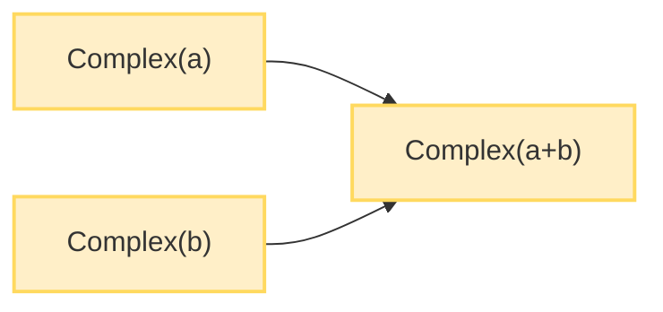

# 📘 이펙티브 자바 스터디

## 📝 아이템 17: 변경 가능성을 최소화하라

### 🔹 요약

✅ 불변 클래스는 인스턴스의 내부 값을 수정할 수 없는 클래스  
✅ 불변 클래스는 가변 클래스보다 설계, 구현, 사용이 쉬우며 오류가 생길 여지가 적음  
✅ 불변 객체는 스레드 안전하여 동기화할 필요가 없음
✅ 불변 클래스를 만드는 5가지 핵심 규칙:

- 객체의 상태를 변경하는 메소드(변경자)를 제공하지 않기
- 클래스를 확장할 수 없도록 하기 (final 클래스로 선언)
- 모든 필드를 final로 선언하기
- 모든 필드를 private으로 선언하기
- 자신 외에는 내부 가변 컴포넌트에 접근할 수 없도록 하기

### 🔹 주의사항

📌 **불변 객체는 값이 다르면 반드시 독립된 객체로 생성해야 함**  
📌 **성능을 위해 다단계 연산을 제공하는 가변 동반 클래스 고려 (예: StringBuilder)**  
📌 **모든 클래스를 불변으로 만들 수는 없으나, 변경할 수 있는 부분을 최소화하는 것이 좋음**

---

### 📚 추가 개념

💡 **불변 객체의 장점**

 <p align="center">
   
 </p>

- **단순함**: 생성된 시점의 상태를 파괴될 때까지 그대로 간직합니다.
- **스레드 안전**: 내부 상태가 절대 변하지 않기 때문에 여러 스레드가 동시에 사용해도 훼손되지 않습니다.
- **안전한 공유**: 불변 객체는 어떤 스레드든 신경 쓰지 않고 공유할 수 있습니다.
- **방어적 복사 불필요**: 복사해도 원본과 같으므로 방어적 복사가 필요 없습니다.
- **실패 원자성 제공**: 상태가 절대 변하지 않으므로 잠깐이라도 불일치 상태에 빠질 일이 없습니다.

#### 🔑 **불변 클래스 설계 방법**

- 클래스를 `final`로 선언하여 상속을 막습니다.
- 모든 필드를 `private final`로 선언합니다.
- 생성자나 정적 팩터리 메소드를 통해서만 객체를 생성할 수 있게 합니다.
- 어떤 메서드도 객체의 상태를 변경할 수 없습니다.

#### 💡 **불변 객체와 정적 팩터리**

- 불변 클래스는 정적 팩터리 메소드를 통해 객체 캐싱 기능을 제공할 수 있습니다.
- 예를 들어, `Boolean.valueOf(boolean)` 메소드는 객체를 캐싱하여 메모리 사용량을 줄입니다.

#### 💡 **함수형 프로그래밍**

- 불변 객체를 활용한 프로그래밍 패러다임으로, 피연산자에 함수를 적용해 그 결과를 반환하지만 피연산자 자체는 변경하지 않습니다.
- 이러한 방식은 코드의 예측 가능성을 높이고 버그를 줄일 수 있습니다.

#### 💡 **불변 객체와 방어적 복사**

- 불변 객체는 내부 데이터가 변하지 않으므로 방어적 복사가 필요 없습니다.
- 그러나 가변 객체를 포함하는 경우에는 생성자에서 받은 가변 객체를 방어적으로 복사해야 합니다.

---

### 🎯 중요한 점

🔹 불변 클래스는 값이 다르면 반드시 독립된 객체로 만들어야 함  
🔹 불변 클래스에서는 모든 필드가 final이어야 함 (일부 JVM 최적화에도 도움)  
🔹 getter가 있다고 해서 setter도 반드시 있어야 하는 것은 아님  
🔹 성능이 중요한 경우 불변 클래스와 함께 가변 동반 클래스를 제공하는 것이 좋음

---

### 💡 코드 예제 및 설명



#### ✅ 불변 클래스 예제

```java
// 상속할 수 없는 클래스 (즉, 이 클래스를 확장하는 서브클래스를 만들 수 없음)
public final class Complex {
    private double re; // 실수부 (real part)
    private double im; // 허수부 (imaginary part)

    public Complex(double re, double im) {
        this.re = re;
        this.im = im;
    }

    // 접근자 메소드(getter)
    public double realPart() { return re; }
    public double imaginaryPart() { return im; }

    // 사칙연산 메소드 - 새로운 Complex 인스턴스 반환
    public Complex plus(Complex c) {
        return new Complex(re + c.re, im + c.im);
    }

    public Complex minus(Complex c) {
        return new Complex(re - c.re, im - c.im);
    }

    public Complex times(Complex c) {
        return new Complex(re * c.re - im * c.im,
                          re * c.im + im * c.re);
    }

    public Complex dividedBy(Complex c) {
        double tmp = c.re * c.re + c.im * c.im;
        return new Complex((re * c.re + im * c.im) / tmp,
                         (im * c.re - re * c.im) / tmp);
    }

    @Override
    public boolean equals(Object o) {
        if (o == this) return true;
        if (!(o instanceof Complex)) return false;
        Complex c = (Complex) o;
        return Double.compare(c.re, re) == 0 &&
               Double.compare(c.im, im) == 0;
    }

    @Override
    public int hashCode() {
        // 31은 소수(Prime number)로 해시 충돌을 줄이고, 비트 연산 최적화가 가능하기 때문에 자주 사용됨
        // 31 * x == (x << 5) - x 로 빠른 비트 연산으로 최적화할 수 있음
        return 31 * Double.hashCode(re) + Double.hashCode(im);
    }

    @Override
    public String toString() {
        return "(" + re + " + " + im + "i)";
    }
}
```

#### ❌ 가변 클래스의 문제점

```java
public class MutablePoint {
    private double x;
    private double y;

    public MutablePoint(double x, double y) {
        this.x = x;
        this.y = y;
    }

    // 변경자 메서드(setter)
    public void setX(double x) { this.x = x; }
    public void setY(double y) { this.y = y; }

    // 접근자 메소드(getter)
    public double getX() { return x; }
    public double getY() { return y; }

    // 다른 객체에서 이 객체의 상태를 변경할 수 있으므로
    // 멀티스레드 환경에서 안전하지 않음
    public void moveTo(double newX, double newY) {
        this.x = newX;
        this.y = newY;
    }
}
```

#### ✅ 불변 클래스 - private 생성자 + 정적 팩터리 메서드

```java
public class Complex {
    private final double re;
    private final double im;

    private Complex(double re, double im) {
        this.re = re;
        this.im = im;
    }

    // 정적 팩터리 메서드
    public static Complex valueOf(double re, double im) {
        return new Complex(re, im);
    }

    // 자주 사용되는 상수 미리 생성
    public static final Complex ZERO = new Complex(0, 0);
    public static final Complex ONE = new Complex(1, 0);
    public static final Complex I = new Complex(0, 1);

    // 나머지 메서드는 위와 동일
}
```

---

### ❗ 어려웠던 점

⚠️ 불변 객체가 포함하는 필드가 가변 객체인 경우 방어적 복사를 통해 보호해야 하는데 이 개념이 처음에는 이해하기 어려웠음

➡️ 불변 클래스에 가변 컴포넌트가 있다면, 해당 컴포넌트를 외부에서 수정할 수 없도록 방어적 복사를 해야 함을 이해함

⚠️ 불변 객체의 경우 함수형 프로그래밍 패러다임을 따름으로 필드 값마다 새 객체를 만들어야 해서 성능 저하의 우려가 있었음

➡️ 매번 새로운 객체를 생성하는 대신 내부적으로 캐싱 메커니즘을 사용하거나, 가변 동반 클래스(예: String과 StringBuilder)를 제공하는 방식으로 개선할 수 있음을 배움

---

### 💭 느낀 점

💡 처음에는 객체를 불변으로 만드는 것이 제약이 많다고 생각했는데, 실제로는 코드의 안정성과 신뢰성을 크게 높여준다는 것을 알게 되었다.

💡 멀티스레드 환경에서 불변 객체를 사용하면 동기화에 대해 걱정할 필요가 없다는 점이 큰 장점이라고 느꼈다.

💡 객체 지향 설계에서 "가변성은 필요한 경우에만 제공하라"는 원칙의 중요성을 깨달았다.
