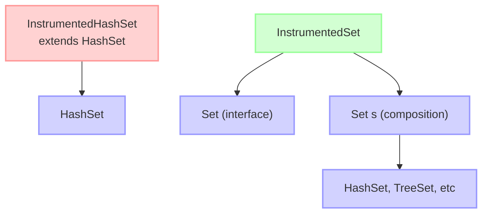

# 📘 이펙티브 자바 스터디

## 📝 아이템 18: 상속보다는 컴포지션을 사용하라

### 🔹 요약

✅ 상속은 코드를 재사용하는 강력한 방법이지만 항상 최선의 도구는 아님  
✅ 상속은 캡슐화를 깨뜨리고 상위 클래스에 종속적이게 만듦  
✅ 컴포지션은 기존 클래스가 새로운 클래스의 구성요소로 쓰이는, 더 안전한 방법  
✅ 래퍼 클래스와 데코레이터 패턴을 활용한 컴포지션 방식이 권장됨  
✅ 상속은 "is-a" 관계가 확실할 때만 사용하는 것이 바람직함

### 🔹 주의사항

📌 **상위 클래스와 하위 클래스가 순수한 is-a 관계일 때만 상속을 사용하라**  
📌 **상위 클래스가 확장을 고려해 설계되지 않았다면 상속보다 컴포지션을 사용하라**  
📌 **패키지 경계를 넘는 상속, 특히 다른 개발자가 작성한 클래스 상속에 주의하라**

---

### 📚 추가 개념

💡 **상속(Inheritance)과 컴포지션(Composition)의 비교**

 <p align="center">
   
 </p>

- **상속(Inheritance)**은 클래스 간에 "is-a" 관계를 구현하는 방식으로, 하위 클래스가 상위 클래스의 특성과 동작을 물려받습니다.
- **컴포지션(Composition)**은 클래스 간에 "has-a" 관계를 구현하는 방식으로, 한 클래스가 다른 클래스의 인스턴스를 포함하여 그 기능을 활용합니다.

#### 🔑 **상속의 문제점**

1. **캡슐화 위반**: 상위 클래스의 구현이 변경되면 하위 클래스가 영향을 받을 수 있습니다.
2. **취약한 기반 클래스 문제**: 상위 클래스의 변경이 하위 클래스의 동작에 예상치 못한 영향을 줄 수 있습니다.
3. **메서드 재정의의 위험**: 하위 클래스에서 재정의한 메서드가 상위 클래스의 내부 동작과 충돌할 수 있습니다.
4. **제약된 유연성**: 상속은 컴파일 타임에 결정되어 런타임에 변경할 수 없습니다.

#### 💡 **래퍼 클래스(Wrapper Class)와 데코레이터 패턴(Decorator Pattern)**

- **래퍼 클래스**는 다른 클래스의 인스턴스를 감싸고(wrap) 그 기능을 확장하는 클래스입니다.
- **데코레이터 패턴**은 객체에 추가 책임을 동적으로 추가하는 패턴으로, 래퍼 클래스를 사용하여 구현됩니다.
- 이 방식은 기존 클래스의 기능을 수정하지 않고 확장할 수 있게 해줍니다.

#### 💡 **전달(Forwarding)과 위임(Delegation)**

- **전달(Forwarding)**은 래퍼 클래스의 메서드가 내부 객체의 해당 메서드를 호출하는 기법입니다.
- **위임(Delegation)**은 더 넓은 개념으로, 객체가 특정 작업을 다른 객체에게 위임하는 것을 의미합니다.
- 컴포지션과 전달을 조합하면 상속의 단점을 피하면서 기능을 재사용할 수 있습니다.

---

### 🎯 중요한 점

🔹 상속은 코드 재사용보다는 타입 계층을 표현할 때 적합함  
🔹 컴포지션은 기존 클래스를 변경하지 않고 새로운 기능을 추가할 수 있음  
🔹 상위 클래스가 자주 변경되는 환경에서는 상속보다 컴포지션이 안전함  
🔹 래퍼 클래스의 단점은 콜백(callback) 프레임워크와는 어울리지 않는다는 점

---

### 💡 코드 예제 및 설명



#### ❌ 상속을 잘못 사용한 예제 (문제 발생)

```java
// HashSet을 상속받아 추가된 원소 개수를 계산하는 클래스
public class InstrumentedHashSet<E> extends HashSet<E> {
    // 추가된 원소의 수
    private int addCount = 0;

    public InstrumentedHashSet() {}

    public InstrumentedHashSet(int initCap, float loadFactor) {
        super(initCap, loadFactor);
    }

    @Override
    public boolean add(E e) {
        addCount++;
        return super.add(e);
    }

    @Override
    public boolean addAll(Collection<? extends E> c) {
        addCount += c.size();
        return super.addAll(c);  // ❌ 문제 발생! 내부적으로 add()를 호출함
    }

    public int getAddCount() {
        return addCount;
    }
}

// 사용 예시
InstrumentedHashSet<String> s = new InstrumentedHashSet<>();
s.addAll(List.of("가", "나", "다"));  // addCount가 예상과 다르게 6이 됨 (원소 3개가 중복 카운트)
```

#### ✅ 컴포지션을 사용한 개선된 예제

```java
// 컴포지션을 사용한 래퍼 클래스
public class InstrumentedSet<E> implements Set<E> {
    // 실제 구현을 위임할 Set 인스턴스
    private final Set<E> s;
    // 추가된 원소의 수
    private int addCount = 0;

    public InstrumentedSet(Set<E> s) {
        this.s = Objects.requireNonNull(s);
    }

    @Override
    public boolean add(E e) {
        addCount++;
        return s.add(e);
    }

    @Override
    public boolean addAll(Collection<? extends E> c) {
        addCount += c.size();
        return s.addAll(c);
    }

    public int getAddCount() {
        return addCount;
    }

    // 나머지 Set 메서드는 s에 위임
    @Override public int size() { return s.size(); }
    @Override public boolean isEmpty() { return s.isEmpty(); }
    @Override public boolean contains(Object o) { return s.contains(o); }
    @Override public Iterator<E> iterator() { return s.iterator(); }
    @Override public Object[] toArray() { return s.toArray(); }
    @Override public <T> T[] toArray(T[] a) { return s.toArray(a); }
    @Override public boolean remove(Object o) { return s.remove(o); }
    @Override public boolean containsAll(Collection<?> c) { return s.containsAll(c); }
    @Override public boolean removeAll(Collection<?> c) { return s.removeAll(c); }
    @Override public boolean retainAll(Collection<?> c) { return s.retainAll(c); }
    @Override public void clear() { s.clear(); }
    @Override public boolean equals(Object o) { return s.equals(o); }
    @Override public int hashCode() { return s.hashCode(); }
    @Override public String toString() { return s.toString(); }
}

// 사용 예시 - 유연한 활용
Set<String> hashSet = new InstrumentedSet<>(new HashSet<>());
Set<String> treeSet = new InstrumentedSet<>(new TreeSet<>());
```

#### ✅ 컴포지션과 전달을 위한 재사용 가능한 전달 클래스

```java
// 재사용 가능한 전달 클래스
public class ForwardingSet<E> implements Set<E> {
    private final Set<E> s;

    public ForwardingSet(Set<E> s) {
        this.s = Objects.requireNonNull(s);
    }

    // Set의 메서드를 전달하는 기능
    @Override public int size() { return s.size(); }
    @Override public boolean isEmpty() { return s.isEmpty(); }
    @Override public boolean contains(Object o) { return s.contains(o); }
    @Override public Iterator<E> iterator() { return s.iterator(); }
    @Override public Object[] toArray() { return s.toArray(); }
    @Override public <T> T[] toArray(T[] a) { return s.toArray(a); }
    @Override public boolean add(E e) { return s.add(e); }
    @Override public boolean remove(Object o) { return s.remove(o); }
    @Override public boolean containsAll(Collection<?> c) { return s.containsAll(c); }
    @Override public boolean addAll(Collection<? extends E> c) { return s.addAll(c); }
    @Override public boolean removeAll(Collection<?> c) { return s.removeAll(c); }
    @Override public boolean retainAll(Collection<?> c) { return s.retainAll(c); }
    @Override public void clear() { s.clear(); }
    @Override public boolean equals(Object o) { return s.equals(o); }
    @Override public int hashCode() { return s.hashCode(); }
    @Override public String toString() { return s.toString(); }
}

// 래퍼 클래스를 간소화한 구현
public class InstrumentedSet<E> extends ForwardingSet<E> {
    private int addCount = 0;

    public InstrumentedSet(Set<E> s) {
        super(s);
    }

    @Override
    public boolean add(E e) {
        addCount++;
        return super.add(e);
    }

    @Override
    public boolean addAll(Collection<? extends E> c) {
        addCount += c.size();
        return super.addAll(c);
    }

    public int getAddCount() {
        return addCount;
    }
}
```

---

### ❗ 어려웠던 점

⚠️ 상속과 컴포지션 중 어떤 것이 적합한지 판단하는 기준이 처음에는 명확하지 않았음

➡️ is-a 관계는 상속, has-a 관계는 컴포지션을 사용하는 것이 좋다는 점을 이해함. 또한 상위 클래스의 구현이 자주 변경되거나 확장을 고려해 설계되지 않았다면 컴포지션이 더 안전하다는 것을 알게 됨

⚠️ 인터페이스의 모든 메서드를 구현하는 전달 클래스 작성이 번거로웠음

➡️ 전달 클래스를 한 번 작성해두면 여러 래퍼 클래스에서 재사용할 수 있으므로 장기적으로는
효율적임을 깨달음. 또한 IDE의 코드 생성 기능을 활용하면 쉽게 작성할 수 있음

---

### 💭 느낀 점

💡 객체 지향 프로그래밍에서 단순히 코드 재사용을 위해 상속을 남용하는 것이 얼마나 위험한지 이해하게 되었다.

💡 컴포지션과 래퍼 클래스를 활용하면 런타임에 동작을 변경할 수 있어 훨씬 유연한 설계가 가능하다는 점이 인상적이었다.

💡 "상속보다 컴포지션"이라는 원칙은 단순한 지침이 아니라 실제 코드의 안정성과 유지보수성에 큰 영향을 미치는 중요한 설계 원칙임을 깨달았다.
