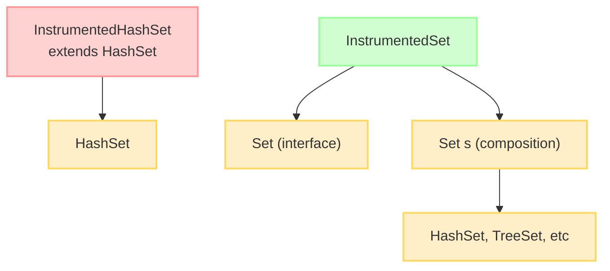

# 18. 상속보다는 컴포지션을 사용하라

## 📝 아이템 18: 상속보다는 컴포지션을 사용하라

### 🔹 요약

✅ 상속은 코드를 재사용하는 강력한 방법이지만 항상 최선의 도구는 아님\
✅ 상속은 캡슐화를 깨뜨리고 상위 클래스에 종속적이게 만듦\
✅ 컴포지션은 기존 클래스가 새로운 클래스의 구성요소로 쓰이는, 더 안전한 방법\
✅ 래퍼 클래스와 데코레이터 패턴을 활용한 컴포지션 방식이 권장됨\
✅ 상속은 "is-a" 관계가 확실할 때만 사용하는 것이 바람직함

### 🔹 주의사항

📌 **상위 클래스와 하위 클래스가 순수한 is-a 관계일 때만 상속을 사용하라**\
📌 **상위 클래스가 확장을 고려해 설계되지 않았다면 상속보다 컴포지션을 사용하라**\
📌 **패키지 경계를 넘는 상속, 특히 다른 개발자가 작성한 클래스 상속에 주의하라**

***

### 📚 추가 개념

💡 **상속(Inheritance)과 컴포지션(Composition)의 비교**

<div align="center"></div>

* **상속(Inheritance)** 은 클래스 간에 "is-a" 관계를 구현하는 방식으로, 하위 클래스가 상위 클래스의 특성과 동작을 물려받습니다.
* **컴포지션(Composition)** 은 클래스 간에 "has-a" 관계를 구현하는 방식으로, 한 클래스가 다른 클래스의 인스턴스를 포함하여 그 기능을 활용합니다.

#### **🔐 캡슐화(Encapsulation)**

*   캡슐화는 객체 지향 프로그래밍의 핵심 원칙 중 하나로, 데이터(속성)와 그 데이터를 처리하는 메서드(행위)를 하나의 단위로 묶고, 객체의 내부 구현을 외부로부터 숨기는 것을 의미합니다.

    📌 **캡슐화의 주요 특징**

    1. **정보 은닉(Information Hiding)**:
       * 객체의 내부 상태를 외부에서 직접 접근하지 못하도록 숨깁니다.
       * 구현 세부사항을 감추고 외부에는 필요한 인터페이스만 제공합니다.
    2. **접근 제어(Access Control)**:
       * 접근 제어자(private, protected, public 등)를 통해 객체의 멤버에 대한 접근 수준을 제한합니다.
       * 일반적으로 필드는 private으로 선언하고, 필요한 경우 getter와 setter 메서드를 통해 접근합니다.
    3. **데이터 보호(Data Protection)**:
       * 객체의 상태가 유효하지 않은 값으로 변경되는 것을 방지합니다.
       * 데이터 검증 로직을 setter 메서드에 포함시켜 객체의 무결성을 보장합니다.
    4. **구현 변경의 유연성(Implementation Flexibility)**:
       * 내부 구현을 변경해도 외부 코드에 영향을 미치지 않습니다.
       * 외부에 공개된 인터페이스만 유지하면 됩니다.

#### 🔑 **상속의 문제점**

1. **캡슐화 위반**: 상위 클래스의 구현이 변경되면 하위 클래스가 영향을 받을 수 있습니다.
2. **취약한 기반 클래스 문제**: 상위 클래스의 변경이 하위 클래스의 동작에 예상치 못한 영향을 줄 수 있습니다.
3. **메서드 재정의의 위험**: 하위 클래스에서 재정의한 메서드가 상위 클래스의 내부 동작과 충돌할 수 있습니다.
4. **제약된 유연성**: 상속은 컴파일 타임에 결정되어 런타임에 변경할 수 없습니다.

### 💡 **래퍼 클래스(Wrapper Class)와 데코레이터 패턴(Decorator Pattern)**

* **래퍼 클래스**는 다른 클래스의 인스턴스를 감싸고(wrap) 그 기능을 확장하는 클래스입니다.
* **데코레이터 패턴**은 객체에 추가 책임을 동적으로 추가하는 패턴으로, 래퍼 클래스를 사용하여 구현됩니다.
* 이 방식은 기존 클래스의 기능을 수정하지 않고 확장할 수 있게 해줍니다.

#### 💡 **전달(Forwarding)과 위임(Delegation)**

* **전달(Forwarding)** 은 `래퍼 클래스(wrapper class)` 또는 특정 객체가 자신의 메서드를 호출하면, 내부에 포함된 객체의 동일한 메서드를 호출하는 기법
* **위임(Delegation)** 은 더 넓은 개념으로, 객체가 특정 작업을 다른 객체에게 위임하는 것을 의미합니다.
* 컴포지션과 전달을 조합하면 상속의 단점을 피하면서 기능을 재사용할 수 있습니다.

***

### 🎯 중요한 점

🔹 상속은 코드 재사용보다는 타입 계층을 표현할 때 적합함\
🔹 컴포지션은 기존 클래스를 변경하지 않고 새로운 기능을 추가할 수 있음\
🔹 상위 클래스가 자주 변경되는 환경에서는 상속보다 컴포지션이 안전함\
🔹 래퍼 클래스의 단점은 콜백(callback) 프레임워크와는 어울리지 않는다는 점

***

### 💡 코드 예제 및 설명



#### ❌ 상속을 잘못 사용한 예제 (문제 발생)

```java
 /**
 * 이 예제는 상속을 부적절하게 사용할 때 발생할 수 있는 문제점을 보여줍니다.
 * HashSet을 확장하여 추가되는 요소의 개수를 세는 기능을 추가하려고 했지만,
 * 내부 구현 세부사항에 의존하게 되어 예상치 못한 동작이 발생합니다.
 */
// HashSet을 상속받아 추가된 원소 개수를 계산하는 클래스
public class InstrumentedHashSet<E> extends HashSet<E> {
    // 추가된 원소의 수를 추적하는 카운터
    private int addCount = 0;

    // 기본 생성자
    public InstrumentedHashSet() {
        // 상위 클래스의 기본 생성자를 호출
    }

    // 초기 용량과 로드 팩터를 지정하는 생성자
    public InstrumentedHashSet(int initCap, float loadFactor) {
        // 상위 클래스의 생성자에 파라미터 전달
        super(initCap, loadFactor);
    }

     /**
     * 단일 원소를 추가하는 메서드를 오버라이드
     * 원소가 추가될 때마다 카운터를 증가시킴
     */
    @Override
    public boolean add(E e) {
        addCount++;
        return super.add(e);
    }

    @Override
    public boolean addAll(Collection<? extends E> c) {
        // 컬렉션 크기만큼 카운트 증가
        addCount += c.size();
        return super.addAll(c);  // ❌ 문제 발생! HashSet의 addAll은 내부적으로 add()를 호출함
    }

    public int getAddCount() {
        return addCount;
    }
}

// 사용 예시
InstrumentedHashSet<String> s = new InstrumentedHashSet<>();
s.addAll(List.of("가", "나", "다"));
/**
 * 예상 결과: addCount = 3 (원소 3개 추가)
 * 실제 결과: addCount = 6 (원소 3개가 중복 카운트됨)
 *
 * 이유: HashSet.addAll이 내부적으로 각 원소마다 add()를 호출하기 때문에
 * 1. addAll에서 c.size()만큼 증가 (+3)
 * 2. add()가 각 원소마다 호출되어 추가로 증가 (+3)
 * 결과적으로 총 6이 증가
 */
```

#### ✅ 컴포지션을 사용한 개선된 예제

```java
/**
 * 이 예제는 상속 대신 컴포지션(구성)을 사용하여 동일한 기능을 안전하게 구현합니다.
 * Set 인터페이스를 구현하고 내부적으로 실제 Set 인스턴스에 작업을 위임합니다.
 */
public class InstrumentedSet<E> implements Set<E> {
   // 실제 구현을 위임할 Set 인스턴스 (컴포지션)
    private final Set<E> s;
    // 추가된 원소의 수
    private int addCount = 0;


    /**
     * 생성자: 래핑할 Set 구현체를 받음
     * 어떤 Set 구현체든 래핑할 수 있어 유연성이 높음
     */
    public InstrumentedSet(Set<E> s) {
        // null 체크를 통한 안전성 확보
        this.s = Objects.requireNonNull(s);
    }

    /**
     * 원소 추가 시 카운트 증가 후 내부 Set에 위임
     */
    @Override
    public boolean add(E e) {
        addCount++;
        return s.add(e);
    }

    /**
     * 컬렉션 추가 시 크기만큼 카운트 증가 후 내부 Set에 위임
     * 상속과 달리 내부 구현 세부사항에 의존하지 않음
     */
    @Override
    public boolean addAll(Collection<? extends E> c) {
        addCount += c.size();
        return s.addAll(c);
    }

    public int getAddCount() {
        return addCount;
    }

    // 나머지 Set 인터페이스 메서드들은 모두 내부 Set에 위임
    // 이를 통해 Set의 모든 기능을 그대로 사용 가능
    @Override public int size() { return s.size(); }
    @Override public boolean isEmpty() { return s.isEmpty(); }
    @Override public boolean contains(Object o) { return s.contains(o); }
    @Override public Iterator<E> iterator() { return s.iterator(); }
    @Override public Object[] toArray() { return s.toArray(); }
    @Override public <T> T[] toArray(T[] a) { return s.toArray(a); }
    @Override public boolean remove(Object o) { return s.remove(o); }
    @Override public boolean containsAll(Collection<?> c) { return s.containsAll(c); }
    @Override public boolean removeAll(Collection<?> c) { return s.removeAll(c); }
    @Override public boolean retainAll(Collection<?> c) { return s.retainAll(c); }
    @Override public void clear() { s.clear(); }
    @Override public boolean equals(Object o) { return s.equals(o); }
    @Override public int hashCode() { return s.hashCode(); }
    @Override public String toString() { return s.toString(); }
}

// 사용 예시 - 유연한 활용
Set<String> hashSet = new InstrumentedSet<>(new HashSet<>());
Set<String> treeSet = new InstrumentedSet<>(new TreeSet<>());

/**
 * 이점:
 * 1. 내부 구현 세부사항에 의존하지 않음 (강한 캡슐화)
 * 2. 다양한 Set 구현체를 사용할 수 있는 유연성
 * 3. 예측 가능한 동작 보장
 */
```

#### ✅ 컴포지션과 전달을 위한 재사용 가능한 전달 클래스

```java
/**
 * 패턴을 더 개선하여 전달(forwarding) 로직을 재사용 가능한 클래스로 분리
 * 재사용 가능한 전달 클래스
 */
public class ForwardingSet<E> implements Set<E> {
    // 위임할 대상 Set
    private final Set<E> s;

    public ForwardingSet(Set<E> s) {
        this.s = Objects.requireNonNull(s);
    }

    // Set 인터페이스의 모든 메서드를 내부 Set에 위임하는 기본 구현 제공
    // 이 클래스를 상속하면 필요한 메서드만 오버라이드하여 기능 추가 가능@Override public int size() { return s.size(); }
    @Override public boolean isEmpty() { return s.isEmpty(); }
    @Override public boolean contains(Object o) { return s.contains(o); }
    @Override public Iterator<E> iterator() { return s.iterator(); }
    @Override public Object[] toArray() { return s.toArray(); }
    @Override public <T> T[] toArray(T[] a) { return s.toArray(a); }
    @Override public boolean add(E e) { return s.add(e); }
    @Override public boolean remove(Object o) { return s.remove(o); }
    @Override public boolean containsAll(Collection<?> c) { return s.containsAll(c); }
    @Override public boolean addAll(Collection<? extends E> c) { return s.addAll(c); }
    @Override public boolean removeAll(Collection<?> c) { return s.removeAll(c); }
    @Override public boolean retainAll(Collection<?> c) { return s.retainAll(c); }
    @Override public void clear() { s.clear(); }
    @Override public boolean equals(Object o) { return s.equals(o); }
    @Override public int hashCode() { return s.hashCode(); }
    @Override public String toString() { return s.toString(); }
}

/**
 * 전달 클래스를 상속하여 래퍼 클래스 구현
 * 필요한 기능만 추가하고 나머지는 상위 클래스의 전달 로직 재사용
 */
public class InstrumentedSet<E> extends ForwardingSet<E> {
    private int addCount = 0;

    // 상위 클래스(ForwardingSet)에 위임할 Set 전달
    public InstrumentedSet(Set<E> s) {
        super(s);
    }

    // 원소 추가 시 카운트 증가 후 상위 클래스에 위임
    @Override
    public boolean add(E e) {
        addCount++;
        return super.add(e);
    }

    // 컬렉션 추가 시 카운트 증가 후 상위 클래스에 위임
    @Override
    public boolean addAll(Collection<? extends E> c) {
        addCount += c.size();
        return super.addAll(c);
    }

    // 추가된 원소 수 반환
    public int getAddCount() {
        return addCount;
    }
}
/**
 * 이점:
 * 1. 데코레이터 패턴의 활용: 기본 기능을 제공하는 객체에 추가 기능을 동적으로 부여
 * 2. 코드 재사용성 향상: 전달 로직을 별도 클래스(ForwardingSet)로 분리하여 중복 제거
 * 3. 유지보수성 향상: 실제 기능 추가는 필요한 메서드만 오버라이드하여 구현
 * 4. 캡슐화 강화: 내부 구현 세부사항에 의존하지 않음
 * 5. 다형성 활용: 다양한 Set 구현체를 동일한 방식으로 확장 가능
 */
```

***

### ❗ 어려웠던 점

⚠️ 상속과 컴포지션 중 어떤 것이 적합한지 판단하는 기준이 처음에는 명확하지 않았음

➡️ is-a 관계는 상속, has-a 관계는 컴포지션을 사용하는 것이 좋다는 점을 이해함. 또한 상위 클래스의 구현이 자주 변경되거나 확장을 고려해 설계되지 않았다면 컴포지션이 더 안전하다는 것을 알게 됨

⚠️ 인터페이스의 모든 메서드를 구현하는 전달 클래스 작성이 번거로웠음

➡️ 전달 클래스를 한 번 작성해두면 여러 래퍼 클래스에서 재사용할 수 있으므로 장기적으로는 효율적임을 깨달음. 또한 IDE의 코드 생성 기능을 활용하면 쉽게 작성할 수 있음

***

### 💭 느낀 점

💡 객체 지향 프로그래밍에서 단순히 코드 재사용을 위해 상속을 남용하는 것이 얼마나 위험한지 이해하게 되었다.

💡 컴포지션과 래퍼 클래스를 활용하면 런타임에 동작을 변경할 수 있어 훨씬 유연한 설계가 가능하다는 점이 인상적이었다.

💡 **"상속보다 컴포지션"** 이라는 원칙은 단순한 지침이 아니라 실제 코드의 안정성과 유지보수성에 큰 영향을 미치는 중요한 설계 원칙임을 깨달았다.
