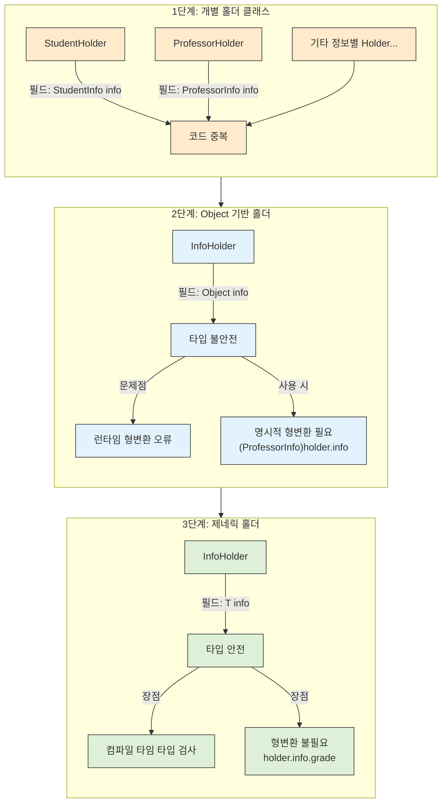

# 29. 이왕이면 제네릭 타입으로 만들라

## 📝 아이템 29: 이왕이면 제네릭 타입으로 만들라

### 🔹 핵심 요약

✅ 클라이언트에서 직접 형변환해야 하는 타입보다 제네릭 타입이 더 안전하고 사용하기 편함\
✅ 기존 타입을 제네릭 타입으로 변경하는 것은 클라이언트에게 영향을 주지 않음 (하위 호환성 유지)\
✅ 새로운 타입을 설계할 때는 형변환 없이도 사용할 수 있도록 제네릭 타입으로 만들어야 함\
✅ 기존 타입 중 제네릭이었어야 하는 것이 있다면 제네릭 타입으로 변경하는 것이 좋음

### 🔹 주의 사항

📌 **제네릭 타입 안에서는 기본 타입(int, double 등)을 사용할 수 없음**\
📌 **실체화 불가 타입(E, List 등)으로는 배열을 만들 수 없음**\
📌 **제네릭 타입의 배열은 E\[]가 아닌 Object\[]로 생성 후 형변환해야 함**

### 🔹 제네릭 타입의 필요성: 코드 진화 과정



#### 1️⃣ 기본 클래스 구현 (코드 중복)

* 각 데이터 유형별로 별도의 클래스를 구현
* 코드 중복이 발생하고 유지보수가 어려움
* 새로운 데이터 유형이 필요할 때마다 새로운 클래스 생성 필요
* 예시) `StudentHolder`와 `ProfessorHolder` 클래스의 구조가 거의 동일하여 코드 중복

```java
// 학생의 학년 정보를 담는 클래스
class StudentInfo {
    public int grade; // 학생의 학년

    // 학생의 학년(1~4)를 초기화하는 생성자
    StudentInfo(int grade) {
        this.grade = grade;
    }
}

// 학생 정보를 가진 클래스
class StudentHolder {
    public StudentInfo info; // 학생 정보

    // 학생 정보를 가진 객체를 초기화하는 생성자
    StudentHolder(StudentInfo info) {
        this.info = info;
    }
}

//교수의 직급 정보를 담는 클래스
class ProfessorInfo {
    public int rank; // 교수의 직급 (조교수, 부교수, 정교수 등)

    /**
     * 교수의 직급 정보를 초기화하는 생성자
     * @param rank 교수의 직급 (1: 조교수, 2: 부교수, 3: 정교수)
     */
    ProfessorInfo(int rank) {
        this.rank = rank;
    }
}

// 교수 정보를 가진 클래스
class ProfessorHolder {
    public ProfessorInfo info; // 교수 정보

    // 교수 정보를 가진 객체를 초기화하는 생성자
    ProfessorHolder(ProfessorInfo info) {
        this.info = info;
    }
}

/**
 * 1단계: 기본 클래스 구현 예시
 * - 서로 다른 정보 유형마다 별도의 Holder 클래스가 필요함
 */
public class Main {
    public static void main(String[] args) {
        // 학생 정보 생성 및 출력
        StudentInfo studentInfo = new StudentInfo(3);
        StudentHolder studentHolder = new StudentHolder(studentInfo);
        System.out.println("학생 학년: " + studentHolder.info.grade); // 3

        // 교수 정보 생성 및 출력
        ProfessorInfo professorInfo = new ProfessorInfo(2);
        ProfessorHolder professorHolder = new ProfessorHolder(professorInfo);
        System.out.println("교수 직급: " + professorHolder.info.rank); // 2 (부교수)
    }
}
```

#### 2️⃣ Object 타입 사용 (타입 불안전)

* Object 타입을 사용하여 모든 데이터 유형을 저장
* 코드 중복은 해결되지만 타입 안전성이 보장되지 않음
* 런타임에 ClassCastException 발생 가능성이 높음
* 명시적 형변환이 항상 필요하여 불편함

```java
// 학생의 학년 정보를 담는 클래스
class StudentInfo {
    public int grade; // 학생의 학년

    // 학생의 학년(1~4)를 초기화하는 생성자
    StudentInfo(int grade) {
        this.grade = grade;
    }
}

//교수의 직급 정보를 담는 클래스
class ProfessorInfo {
    public int rank; // 교수의 직급 (조교수, 부교수, 정교수 등)

    /**
     * 교수의 직급 정보를 초기화하는 생성자
     * @param rank 교수의 직급 (1: 조교수, 2: 부교수, 3: 정교수)
     */
    ProfessorInfo(int rank) {
        this.rank = rank;
    }
}

// 모든 종류의 정보를 저장할 수 있는 범용 홀더 클래스
class InfoHolder {
    public Object info; // 어떤 타입의 정보도 저장 가능

    /**
     * 정보를 가진 객체를 초기화하는 생성자
     * @param info 저장할 정보 객체 (*Info타입을 넣으라는 것이 의도)
     */
    InfoHolder(Object info) {
        this.info = info;
    }
}

/**
 * 2단계: Object 타입 사용 예시
 * - 타입 안전성이 보장되지 않음
 */
public class Main {
    public static void main(String[] args) {
        // 의도에 맞지 않는 홀더 생성
        InfoHolder holder = new InfoHolder("201912345");

        // 문제 발생: 실행 시점에 ClassCastException 발생
        // 문자열을 ProfessorInfo로 형변환하려고 시도
        // ClassCastException은 런타임 에러(실행 전 알기 어려움)
        ProfessorInfo professorInfo = (ProfessorInfo)holder.info;

        // 이 코드는 실행되지 않음
        System.out.println("교수 직급: " + professorInfo.rank);
    }
}
```

#### 3️⃣ 제네릭 타입 사용 (타입 안전성 확보)

* 제네릭을 사용하여 타입 안전성과 코드 재사용성 모두 확보
* 컴파일 시점에 타입 오류를 발견할 수 있음
* 명시적 형변환이 불필요하여 코드가 간결해짐
* 타입 파라미터에 제약을 둘 수 있음

```java
class InfoHolder<T> {
    private T data;

    InfoHolder(T data) {
        this.data = data;
    }

    public T getData() {
        return data;
    }
}

// 사용 예
InfoHolder<StudentInfo> holder = new InfoHolder<>(new StudentInfo(2));
StudentInfo sd = holder.getData(); // 형변환 불필요
```

***

### 📚 필수 개념 정리

💡 **제네릭 타입의 장점**

* **타입 안전성**: 컴파일 시점에 타입 체크를 통해 잘못된 타입 사용을 방지합니다.
* **형변환 불필요**: 제네릭을 사용하면 클라이언트 코드에서 명시적인 형변환이 필요 없습니다.
* **코드 재사용성**: 다양한 타입에 대해 동일한 코드를 사용할 수 있습니다.
* **런타임 오류 감소**: 타입 오류를 컴파일 시간에 잡아내므로 런타임 오류가 줄어듭니다.

#### 🔑 **제네릭 타입 설계 방법**

* 클래스 선언에 타입 매개변수를 추가합니다.
* 클래스 내부에서 Object 타입을 사용하던 부분을 타입 매개변수로 대체합니다.
* 클라이언트 코드에서 타입 매개변수를 명시하면 컴파일러가 해당 타입에 맞게 처리합니다.

#### 💡 **제네릭 타입의 제약**

* 제네릭 클래스가 인스턴스화될 때 타입 매개변수는 소거됩니다(타입 소거).
* 제네릭 타입으로는 배열을 직접 생성할 수 없습니다.
* 제네릭 타입 파라미터는 정적 필드나 메서드에서 사용할 수 없습니다.

```java
public class Example<T> {
    // 불가능: static T defaultValue;
    // 불가능: static T getDefaultValue() { ... }
}
```

#### 🧐 **제네릭 배열을 직접 만들 수 없는 이유**

* 실체화 불가 타입(`E`, `List<E>` 등)으로는 배열을 만들 수 없습니다.
* 배열은 런타임에도 자신의 타입을 유지하며, 타입 검사를 수행해야 하기 때문이다.
* 하지만, 제네릭 타입은 타입 소거로 인해 실체화되지 않는다.
* 다음과 같은 방법으로 우회할 수 있습니다:

1.  **Object 배열을 생성한 후 형변환** (비검사 경고 발생)

    ```java
    @SuppressWarnings("unchecked")  // 비검사 경고 숨김
    E[] elements = (E[]) new Object[capacity];
    ```
2.  **배열을 Object\[]로 선언 후 원소를 가져올 때 형변환**

    ```java
    private Object[] elements;
    public E pop() {
        return (E) elements[--size]; // 형변환 필요
    }
    ```

#### ❓ **이 코드의 결과는?**

```java
import java.util.*;

class Main {
    public static void main(String[] args) {
        List<String> list1 = new ArrayList<>();
        List<Integer> list2 = new ArrayList<>();

        System.out.println(list1.getClass() == list2.getClass());
    }
}
```

**→ 결과는 `true`**

👉 **왜 다르게 보이는 두 리스트가 같은 타입일까?**\
👉 **제네릭 타입이 컴파일 후 어떻게 변하는 걸까?**

#### 💡 **제네릭의 타입 소거**

* **제네릭 타입 정보는 컴파일 타임에만 존재하고, 런타임에는 제거된다.**
* 따라서 `List<String>`과 `List<Integer>`는 **컴파일 후 같은 `ArrayList`** 가 된다.
* 왜 그럴까? **제네릭은 타입 안정성을 위해 JDK 1.5부터 도입된 문법으로, 기존 코드(Java 5 이전)와 호환 가능하기 위해 타입 소거된다.**

```java
// 컴파일 후 변환된 코드 (타입 소거 적용)
List list1 = new ArrayList(); // List<String> → List
List list2 = new ArrayList(); // List<Integer> → List

System.out.println(list1.getClass() == list2.getClass()); // true
```

### 🔥 타입 소거의 영향

* **장점:**\
  ✅ 제네릭을 사용해도 기존 코드(Java 5 이전)와 호환 가능\
  ✅ 다양한 타입을 하나의 코드로 처리 가능
* **단점:**\
  ❌ **제네릭 배열을 만들 수 없음** (`new E[]` 불가)\
  ❌ 런타임에 타입 정보를 알 수 없어 `instanceof` 같은 타입 검사가 어려움\
  ❌ 잘못된 형변환 시 컴파일이 아니라 **런타임에 오류 발생**

***

### 🎯 중요한 점

🔹 제네릭 타입은 클라이언트에서 타입 안전성과 편의성을 모두 제공함\
🔹 기존 코드의 하위 호환성을 유지하면서 제네릭 타입으로 변경 가능\
🔹 제네릭 메서드도 제네릭 타입과 마찬가지로 형변환 없이 사용할 수 있어 타입 안전함\
🔹 제네릭 타입에서는 원소의 타입을 컴파일러가 자동으로 관리하므로 오류 가능성이 낮음

***

### 💡 코드 예제 및 설명

#### ✅ 제네릭 배열 생성 방법 - 두 가지 방법

```java
// 첫 번째 방법: Object 배열을 사용한 Stack 클래스
public class Stack<E> {
    private E[] elements;
    private int size = 0;
    private static final int DEFAULT_INITIAL_CAPACITY = 16;

    // 배열 생성 시 형변환 경고 발생
    @SuppressWarnings("unchecked")
    public Stack() {
        // 실체화 불가 타입으로 배열을 생성할 수 없어 Object 배열을 생성 후 형변환
        elements = (E[]) new Object[DEFAULT_INITIAL_CAPACITY];
    }
}
```

```java
// 두 번째 방법: E[] 배열로 형변환한 Stack 클래스
    // pop 메서드에서 형변환 필요
    @SuppressWarnings("unchecked")
    public E pop() {
        if (size == 0)
            throw new EmptyStackException();

        // 비검사 형변환이지만 타입 안전성 보장
        E result = (E) elements[--size];
        elements[size] = null; // 다 쓴 참조 해제
        return result;
    }
```

**🏆 결론**: 두 번째 방법은 pop() 호출 때마다 (E) 캐스팅이 필요해서 형변환을 여러 번 수행해야 하고,\
타입 안정성이 떨어지지만, 첫 번째 방법은 생성자에서 한 번만 형변환하면 되므로 코드가 더 깔끔하고 타입 안전성도 더 높아 **첫 번재 방법이 선호된다.**

***

### ❗ 어려웠던 점

⚠️ 제네릭 타입의 타입 소거 개념을 이해하기 어려웠음

➡️ 제네릭은 컴파일 타임에만 타입 체크를 하고, 런타임에는 모든 타입 정보가 제거됨. 이것이 실체화 불가 타입이라고 불리는 이유이며, 이로 인해 배열 생성 시 제약이 있음

***

### 💭 느낀 점

💡 제네릭 타입을 사용하면 코드의 안전성과 가독성이 크게 향상된다는 것을 깨달았다.

💡 제네릭 타입을 처음 설계할 때는 복잡해 보일 수 있지만, 클라이언트 코드에서 사용할 때 얻을 수 있는 이점이 매우 크다.

💡 기존 코드를 제네릭으로 변환하는 것은 단순한 작업은 아니지만, 타입 안전성을 높이고 코드 품질을 개선하는 데 큰 도움이 된다.
