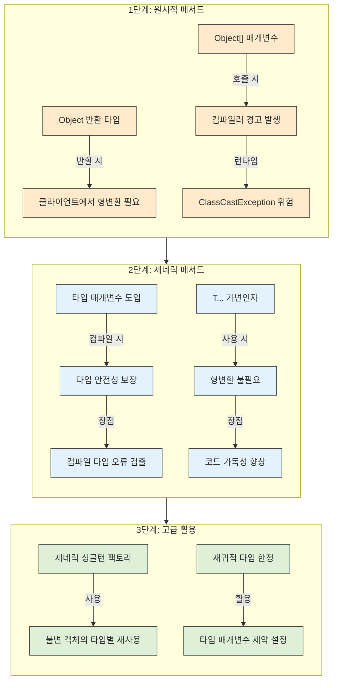

# 30. 이왕이면 제네릭 메서드로 만들라

## 📝 아이템 30: 이왕이면 제네릭 메서드로 만들라

### 🔹 핵심 요약

✅ 메서드도 클래스와 마찬가지로 제네릭으로 만들면 더 안전하고 사용하기 편함\
✅ 제네릭 메서드는 클라이언트가 입력 매개변수와 반환값을 명시적 형변환 없이 사용 가능\
✅ 불필요한 형변환을 없애 코드 가독성과 안전성을 높임\
✅ 자기 자신이 속한 클래스에 정의된 타입 매개변수와는 별개의 타입 매개변수 사용 가능

### 🔹 주의 사항

📌 **타입 매개변수 명명 규칙을 따르는 것이 좋음(E, T, K, V 등)**\
📌 **제네릭 메서드를 호출할 때는 명시적 타입 인수를 대부분 생략 가능(컴파일러가 타입 추론)**\
📌 **재귀적 타입 한정(recursive type bound)을 사용해 타입 매개변수의 허용 범위를 한정할 수 있음**\
📌 **제네릭 싱글턴 팩토리를 사용하면 불변 객체를 여러 타입으로 활용 가능**

### 🔹 제네릭 메서드의 필요성: 코드 진화 과정



#### 1️⃣ 원시적 메서드 구현 (타입 불안전)

* Object 타입을 사용해 모든 타입의 객체를 처리
* Set의 원소가 Object 타입으로 취급
* 클라이언트에서 명시적 형변환이 필요
* 형변환 오류가 런타임에 발생할 가능성 존재
* 컴파일러가 타입 안정성을 보장하지 못함

```java
// 원시적인 Union 메서드 - 타입 불안전
public static Set union(Set s1, Set s2) {
    Set result = new HashSet(s1); // 비검사 경고
    result.addAll(s2);           // 비검사 경고
    return result;
}

// 사용 예
Set numbers = new HashSet(Arrays.asList(1, 2, 3));
Set letters = new HashSet(Arrays.asList("a", "b", "c"));
Set result = union(numbers, letters);
// 명시적 형변환 필요
Integer i = (Integer) result.iterator().next(); // ClassCastException 발생 위험
```

#### 2️⃣ 제네릭 메서드 구현 (타입 안전성 확보)

* 타입 매개변수를 사용하여 타입 안전성을 확보
* 컴파일 시점에 타입 오류를 확인 가능
* 클라이언트에서 명시적 형변환이 불필요
* 컴파일러가 타입 추론을 통해 오류를 방지

```java
// 제네릭 메서드
public static <E> Set<E> union(Set<E> s1, Set<E> s2) {
    Set<E> result = new HashSet<>(s1);
    result.addAll(s2);
    return result;
}

// 사용 예
Set<Integer> numbers = Set.of(1, 2, 3);
Set<Integer> moreNumbers = Set.of(4, 5, 6);
Set<Integer> result = union(numbers, moreNumbers); // 형변환 불필요
Integer i = result.iterator().next(); // 안전한 코드
```

#### 3️⃣ 고급 활용 기법

* 제네릭 싱글턴 팩토리를 사용하여 불변 객체를 타입별로 활용
* 재귀적 타입 한정을 사용하여 타입 매개변수의 범위 제한
* 타입 추론과 메서드 참조를 통한 간결한 코드 작성

```java
// 제네릭 싱글턴 팩토리 패턴
public static <T> Comparator<T> reverseOrder() {
    return (Comparator<T>) ReverseComparator.REVERSE_ORDER;
}

// 재귀적 타입 한정을 이용한 max 메서드
public static <E extends Comparable<E>> E max(Collection<E> c) {
    if (c.isEmpty())
        throw new IllegalArgumentException("빈 컬렉션");

    E result = null;
    for (E e : c)
        if (result == null || e.compareTo(result) > 0)
            result = e;

    return result;
}
```

***

### 📚 필수 개념 정리

💡 **제네릭 메서드란?**

* 메서드 선언부에 타입 매개변수를 선언한 메서드입니다.
* 타입 매개변수의 범위는 메서드 내부로 한정됩니다.
* 정적 메서드나 인스턴스 메서드 모두 제네릭 메서드로 만들 수 있습니다.
* 제네릭 클래스가 아니더라도 제네릭 메서드는 정의할 수 있습니다.

#### 🔑 **제네릭 메서드 작성법**

* 메서드의 제한자와 반환 타입 사이에 타입 매개변수를 선언합니다.
* 일반적으로 타입 매개변수는 대문자 한 글자로 명명합니다.

```java
public static <E> Set<E> union(Set<E> s1, Set<E> s2) { ... }
//            ↑↑↑ 타입 매개변수 선언
```

#### 💡 **제네릭 싱글턴 팩토리**

* 제네릭은 런타임에 타입 정보가 소거되므로, 여러 타입으로 활용 가능한 하나의 객체를 만들 수 있습니다.
* 불변 객체를 타입 안전하게 여러 타입으로 재사용할 수 있습니다.
* `Collections.emptyList()`, `Collections.emptyMap()` 등이 이 패턴을 사용합니다.

```java
// 제네릭 싱글턴 팩토리 패턴
@SuppressWarnings("unchecked")
public static <T> Comparator<T> reverseOrder() {
    return (Comparator<T>) ReverseComparator.REVERSE_ORDER;
}

// 활용 예
Comparator<String> stringComparator = Collections.reverseOrder();
Comparator<Integer> integerComparator = Collections.reverseOrder();
```

#### 🧐 **재귀적 타입 한정(Recursive Type Bound)**

* 타입 매개변수가 자신을 포함하는 표현식에 의해 한정됩니다.
* 주로 타입의 자연적 순서를 정의하는 `Comparable` 인터페이스와 함께 사용됩니다.
* 타입 매개변수에 특정 인터페이스나 클래스를 구현/상속한 타입만 받도록 제한합니다.

```java
// <E extends Comparable<E>>는 E 타입이 자기 자신과 비교할 수 있어야 함을 의미
public static <E extends Comparable<E>> E max(Collection<E> c) {
    if (c.isEmpty())
        throw new IllegalArgumentException("컬렉션이 비어 있습니다.");

    E result = null;
    for (E e : c) {
        if (result == null || e.compareTo(result) > 0)
            result = e;
    }
    return result;
}
```

#### ❓ **재귀적 타입 한정(Recursive Type Bound)이 왜 필요한가요?**

* 이 제약이 없다면, `max` 메서드는 `compareTo` 메서드를 호출할 수 없습니다.
* `compareTo` 메서드는 `Comparable`을 구현한 클래스에서만 사용 가능하기 때문입니다.
* 타입 `E`가 `Comparable`을 구현한다는 보장이 있어야만 사용할 수 있습니다.
* **재귀적 타입 한정**을 사용한다면 얻을 수 있는 이점이 있습니다.:

1. **컴파일러가 타입 안전성을 검증할 수 있습니다.**
2. **타입 제약을 통해 메서드가 예상대로 동작하도록 할 수 있습니다.**
3. **비교 불가능한 타입으로 메서드를 호출하면 컴파일 오류가 발생합니다.**

#### 💡 **타입 추론과 제네릭 메서드**

* Java 컴파일러는 메서드 호출 시 타입 매개변수의 값을 추론할 수 있음
* 대부분의 경우 호출 시 타입 인수를 명시할 필요가 없음
* 타입 추론의 한계가 있는 경우 명시적으로 타입을 지정할 수 있음

```java
// 명시적 타입 지정이 필요 없는 경우 (컴파일러가 추론)
Set<Integer> integers = Set.of(1, 3, 5);
Set<Double> doubles = Set.of(2.0, 4.0, 6.0);
Set<Number> numbers = union(integers, doubles); // 컴파일 오류!

// 타입 매개변수를 명시적으로 지정해야 하는 경우
// Set<Number> numbers = Union.<Number>union(integers, doubles); // 이 경우도 컴파일 오류
```

### 🔥 제네릭 메서드의 이점과 한계

* **장점:**\
  ✅ 타입 안전성 - 컴파일 시점에 타입 오류 검출\
  ✅ 가독성 향상 - 명시적 형변환 제거\
  ✅ 코드 재사용성 - 다양한 타입에 동일한 로직 적용
* **한계:**\
  ❌ 기본 타입(int, double 등)은 직접 사용할 수 없음\
  ❌ 타입 소거로 인해 런타임에 타입 정보 접근 제한적\
  ❌ 한 메서드에서 서로 다른 타입에 대해 다른 동작을 구현하기 어려움

***

### 🎯 중요한 점

🔹 제네릭 메서드는 타입 매개변수를 선언하는 메서드\
🔹 제네릭 메서드를 사용하면 클라이언트 코드에서 형변환이 불필요\
🔹 컴파일 시점에 타입 안전성을 보장해 런타임 오류 가능성 감소\
🔹 제네릭 싱글턴 팩토리와 재귀적 타입 한정은 제네릭 메서드의 활용도를 높임

***

### 💡 코드 예제 및 설명

#### ✅ 제네릭 메서드의 다양한 활용

```java
// 예제 1: 제네릭 메서드 기본 형태
public static <T> List<T> asList(T... a) {
    return new ArrayList<>(Arrays.asList(a));
}

// 예제 2: 제네릭 메서드에서의 와일드카드 활용
public static <T> boolean addAll(Collection<? super T> c, T... elements) {
    boolean result = false;
    for (T element : elements)
        result |= c.add(element);
    return result;
}

// 예제 3: 제네릭 싱글턴 팩토리 패턴
public static <K, V> Map<K, V> emptyMap() {
    return (Map<K, V>) EMPTY_MAP;
}

// 예제 4: 항등함수(identity function)를 반환하는 제네릭 메서드
private static final UnaryOperator<Object> IDENTITY_FN = (t) -> t;

@SuppressWarnings("unchecked")
public static <T> UnaryOperator<T> identityFunction() {
    return (UnaryOperator<T>) IDENTITY_FN;
}

// 사용 예시
public static void main(String[] args) {
    String[] strings = { "삼베", "대마", "나일론" };
    UnaryOperator<String> sameString = identityFunction();
    for (String s : strings)
        System.out.println(sameString.apply(s));

    Number[] numbers = { 1, 2.0, 3L };
    UnaryOperator<Number> sameNumber = identityFunction();
    for (Number n : numbers)
        System.out.println(sameNumber.apply(n));
}
```

#### ✅ 재귀적 타입 한정을 이용한 예제

```java
// Comparable을 구현한 원소의 컬렉션에서 최댓값을 찾는 메서드
public static <E extends Comparable<E>> E max(Collection<E> c) {
    if (c.isEmpty())
        throw new IllegalArgumentException("빈 컬렉션");

    E result = null;
    for (E e : c) {
        if (result == null || e.compareTo(result) > 0)
            result = e;
    }
    return result;
}

// 사용 예시
public static void main(String[] args) {
    List<String> argList = Arrays.asList(args);
    System.out.println(max(argList));

    List<Integer> numbers = Arrays.asList(1, 2, 3, 4, 5);
    System.out.println(max(numbers));
}
```

**🏆 더 복잡한 재귀적 타입 한정 예제**

```java
// Comparable<T>를 구현한 타입 T의 서브타입을 받는 메서드
public static <T extends Comparable<? super T>> T max(List<? extends T> list) {
    if (list.isEmpty())
        throw new IllegalArgumentException("빈 리스트");

    T result = list.get(0);
    for (int i = 1; i < list.size(); i++) {
        if (list.get(i).compareTo(result) > 0)
            result = list.get(i);
    }
    return result;
}
```

이 메서드는 `<T extends Comparable<? super T>>`라는 타입 한정을 사용해 T 타입이 자신과 비교 가능함을 보장합니다. `? super T`는 T의 상위 타입을 허용하므로, T가 상위 타입과 비교 가능한 경우에도 활용할 수 있습니다.

***

### ❗ 어려웠던 점

⚠️ 재귀적 타입 한정이 처음에는 이해하기 어려웠음

➡️ `<E extends Comparable<E>>`는 E 타입이 자기 자신과 비교 가능해야 함을 의미. 즉, E 타입은 Comparable 인터페이스를 구현해야 한다는 제약 조건을 나타냄

⚠️ 제네릭 싱글턴 팩토리 패턴의 활용이 어려웠음

➡️ 제네릭은 타입 소거로 인해 런타임에는 하나의 객체만 존재. 이를 활용해 여러 타입으로 재사용할 수 있는 패턴임을 이해함

***

### 💭 느낀 점

💡 제네릭 메서드는 복잡해 보이지만, 코드 안전성과 가독성을 크게 향상시킨다.

💡 타입 추론 덕분에 제네릭 메서드를 사용할 때 실제로는 타입을 명시할 필요가 거의 없어 편리하다.

💡 제네릭의 타입 한정을 잘 활용하면 API의 표현력과 안전성을 동시에 높일 수 있다.

💡 제네릭 메서드를 처음부터 설계하면 나중에 타입 관련 문제가 발생할 가능성이 크게 줄어든다.
