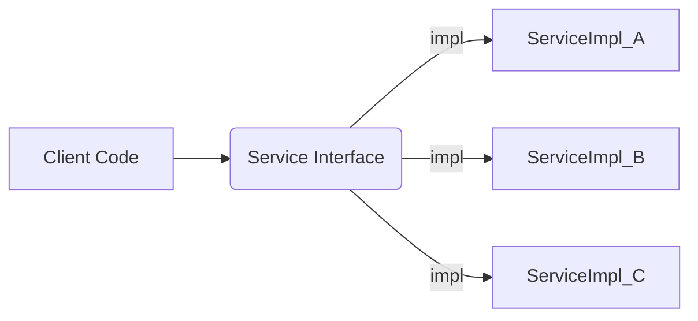

### **주제: 객체는 인터페이스를 사용해 참조하라**

- **(개념)** 객체를 담는 변수, 필드, 메서드 매개변수, 반환 타입 등을 선언할 때, 실제 객체의 구체 클래스 타입 대신 해당 객체가 구현한 인터페이스 타입을 사용하라는 원칙.
- **(확장)** 아이템 51 "매개변수 타입으로 인터페이스 사용" 원칙을 프로그램 전반으로 확장.

---

### **핵심 원칙**

- **참조는 인터페이스로 (Reference via Interface)**
    <!-- * (적합한 인터페이스가 있다면, 변수/필드/매개변수/반환값 모두 인터페이스 타입 사용) -->
- **생성만 클래스로 (Instantiate with Class)**

  ```java
  // 좋은 예: 인터페이스로 참조, 클래스로 생성
  List<User> users = new ArrayList<>();
  Map<String, Data> dataMap = new HashMap<>();
  MemberService service = new MemberServiceImpl();

  // 나쁜 예: 구체 클래스로 참조 (유연성 저하)
  ArrayList<User> users2 = new ArrayList<>();
  ```

---

### **장점**



- **유연성 향상 (Increased Flexibility)**

    <!-- * (코드가 특정 구현 클래스에 대한 의존성을 낮춤. 클라이언트는 인터페이스만 바라봄)
    *  아래 다이어그램은 클라이언트 코드가 구체적인 구현(A, B)을 직접 알 필요 없이 인터페이스를 통해 상호작용하는 모습을 보여줍니다. -->

- **구현 교체 용이 (Easy Implementation Swapping)**
- **테스트 용이성 & DI 활용 (Improved Testability & DI Usage)**
    <!-- * (테스트 시 Mock 객체 등 다른 구현 주입 용이. 스프링 DI의 핵심 원리)
    * **(코드 예시 - Spring DI)** -->

  ```java
  @Component // 또는 @Controller, @Service 등
  public class MyComponent {
      private final MemberService memberService; // ★ 인터페이스 타입으로 주입받음

      @Autowired // 생성자 주입 권장
      public MyComponent(MemberService memberService) {
          this.memberService = memberService;
      }

      public void doSomething() {
          // memberService의 실제 구현이 MemberServiceImpl이든,
          // NewMemberServiceImpl이든 이 코드는 변경 불필요
          memberService.someMethod();
      }
  }
  ```

---

### **주의점 (Potential Issues)**

- **암묵적 동작 의존 (Dependency on Implicit Behavior)**

  - LinkedHashSet -> HashSet
  <!-- * (인터페이스 계약 외, 특정 구현 클래스의 고유 동작 방식(예: `LinkedHashSet`의 순서 보장)에 의존하는 코드는 구현 변경 후 문제 발생 가능성) -->

- **컴파일 시점 오류 (Compile-time Errors)**
    <!-- * (구체 클래스 타입으로 참조하며 해당 클래스 **고유 메서드**를 사용한 경우, 다른 구현체로 변경 시 해당 메서드가 없어 컴파일 오류 발생) -->

  ```java
  ArrayList<String> names = new ArrayList<String>();
  //List<String> names = new LinkedList<>();

  names.trimToSize(); // 컴파일 에러! List 인터페이스 및 LinkedList에는 해당 메서드 없음
  ```

---

### **예외 (인터페이스 사용 비권장/불가)**

- **적합한 인터페이스 부재 (No Suitable Interface)**

- **값 클래스 (`Value Classes`)**

  - `String`, `Integer`, `BigInteger` 등. 클래스 타입 직접 사용

- **클래스 기반 프레임워크 (Class-based Frameworks)**

  - (예: `java.io.InputStream`, `OutputStream`)
  - (이 경우에도 특정 구현 클래스보다는 **기반(추상) 클래스**로 참조 권장)
  - **(시각화 - PlantUML)** `InputStream` 계층 구조 예시입니다. 다양한 구현체가 `InputStream`이라는 추상 클래스를 상속합니다.

  - **(코드 예시 - 기반 클래스 사용)**

    ```java
    // 다양한 InputStream 구현체를 동일 방식으로 처리 가능
    void processStream(InputStream is) throws IOException {
        // is가 FileInputStream이든 ByteArrayInputStream이든
        // InputStream의 메서드(read, close 등)만 사용하므로 동일 로직 적용 가능
        int data;
        while ((data = is.read()) != -1) {
            // ... 데이터 처리 ...
        }
        is.close(); // 리소스 해제 (try-with-resources 권장)
    }

    // 사용 예시
    InputStream fileInput = new FileInputStream("data.txt");
    processStream(fileInput);

    byte[] memoryData = ...;
    InputStream memoryInput = new ByteArrayInputStream(memoryData);
    processStream(memoryInput);
    ```

- **구체 클래스 고유 메서드 필수 사용 시 (Need for Class-specific Methods)**
  - (인터페이스에 정의되지 않은, 해당 구현 클래스만의 필수 기능 사용 시. 예: `PriorityQueue`의 `comparator()`)

---

### **예외 상황 대처 (Handling Exceptions)**

- **Trade-off 인지 (Acknowledge Trade-off)** (유연성 < 특정 기능 이점)
- **대처 방안 (Choose Your Approach)**
  - **구체 클래스 타입 직접 선언 (Declare Concrete Class Type)**
  - **`instanceof` + 캐스팅 (Use `instanceof` + Casting)**
    - **(코드 예시)**
      ```java
      if (users instanceof ArrayList) {
          ((ArrayList<User>) users).ensureCapacity(1000); // ArrayList 고유 메서드 사용
      }
      ```

---

### **최종 요약 (Key Takeaway)**

> **"특별한 이유(고유 메서드 필수 사용 등)가 없다면, 항상 가장 추상적인 타입(인터페이스 > 상위 클래스)으로 참조하라. 특정 구현의 이점이 유연성보다 명확히 중요할 때만 예외를 고려하고 대처하라."**
