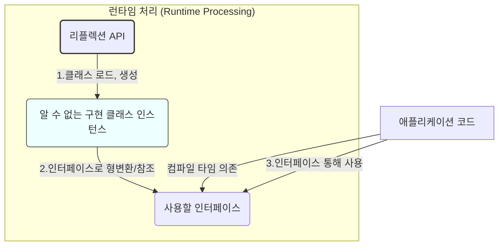

### **주제: 리플렉션보다는 인터페이스를 사용하라**

- **(핵심)** `java.lang.reflect` 패키지를 통해 런타임에 클래스 정보를 얻고 조작할 수 있지만, 단점이 많아 매우 제한적으로 사용해야 하며, 가능하다면 인터페이스 기반 접근을 우선해야 한다.

---

### **리플렉션이란?**

- 프로그램 실행 중(런타임)에 임의의 클래스에 접근 가능.

- `Class`, `Constructor`, `Method`, `Field` 인스턴스.

- 가능한 작업

  - 클래스/멤버 정보 조회
  - 실제 멤버 조작:
    - 인스턴스 생성 (`Constructor.newInstance()`).
    - 메서드 호출 (`Method.invoke()`).
    - 필드 값 접근/수정 (`Field.get()`, `Field.set()`).

- 컴파일 시점에는 존재하지 않거나 알 수 없었던 클래스도 런타임에 로드하여 사용 가능.

<!--
* 리플렉션(`java.lang.reflect`)은 프로그램 실행 중에 임의의 클래스 정보(생성자, 메서드, 필드 등)에 접근하고 그 정보를 가져올 수 있는 기능

* `Class` 객체를 통해 해당 클래스의 `Constructor`, `Method`, `Field` 인스턴스를 얻고, 이를 통해 멤버 이름, 타입, 시그니처 등의 세부 정보를 파악 가능.

나아가 Constructor, Method, Field 인스턴스를 이용해 각각에 연결된 실제 생성자, 메서드, 필드를 조작해서
해당 클래스의 인스턴스를 생성하거나, 메서드를 호출하거나, 필드에 접근할 수 있다

예를 들어 Method.invoke는 어떤 클래스의 어떤 객체가 가진 어떤 메서드라도 호출할 수 있게 해준다

리플렉션을 이용하면 컴파일 당시에 존재하지 않던 클래스도 이용할 수 있는데, 물론 단점이 있다.
-->

---

### **리플렉션의 단점**

<!-- `컴파일타임 타입 검사가 주는 이점을 하나도 누릴 수 없다.` -->

1. **컴파일타임 검사 이점 상실 (Loss of Compile-time Checking Benefits)**

   - **타입 안전성 X**
     - 잘못된 타입의 객체나 메서드 사용 시 런타임 오류 발생.
   - **예외 검사 X**
     - 리플렉션 API는 확인된 예외(Checked Exception)를 제대로 검사하지 못함.
     - 존재하지 않거나 접근 불가한 멤버 호출 시 `RuntimeException` 또는 관련 리플렉션 예외 발생.

2. **지저분하고 장황한 코드**
   - 단순한 생성/호출에도 많은 리플렉션 API 호출 및 광범위한 `try-catch` 블록 필요. 가독성 저하.
3. **성능 저하**
   - 일반적인 메서드 호출이나 필드 접근보다 '훨씬' 느림. 분석 및 해석 오버헤드 발생.
   - **(참고)** 실제 테스트 시 메서드 호출 속도 11배 차이.

<!--
* 코드 분석 도구나 의존관계 주입(DI) 프레임워크 같은 복잡한 애플리케이션에서 리플렉션이 필요할 수 있습니다.
* 하지만 이러한 도구들조차 단점 때문에 리플렉션 사용을 줄이는 추세이며, 꼭 필요한 경우가 아니라면 사용하지 않는 것이 좋습니다.
-->

---

### **권장 사용 패턴**



<!-- 리플렉션은 아주 제한된 형태로만 사용해야 그 단점을 피하고 이점만 취할 수 있다.

컴파일타임에 이용할 수 없는 클래스를 사용해야만 하는 프로그램은 비록 컴파일타임이라도 적절한 인터페이스나 상위 클래스를 이용할 수는 있을 것이다(Item64).

다행히 이런 경우라면 리플렉션은 인스턴스 생성에만 쓰고, 이렇게 만든 인스턴스는 인터페이스나 상위 클래스로 참조해 사용하자. -->

- **아주 제한적 사용**

- 핵심

  - 생성은 리플렉션, 사용은 인터페이스/상위 클래스

  - 컴파일 시점에는 구체 클래스를 알 수 없지만, **사용할 인터페이스나 상위 클래스는 아는 경우**.

- 과정

  1. 리플렉션 API를 사용해 **인스턴스를 생성**.

     - `Class.forName()`, `getDeclaredConstructor()`, `newInstance()`

  2. 생성된 인스턴스를 **컴파일 시점에 아는 인터페이스나 상위 클래스 타입으로 형변환**하여 변수에 할당.

  3. 이후 코드에서는 **해당 인터페이스/상위 클래스에 정의된 메서드만 사용**하여 객체 처리. (리플렉션 코드와 분리)

---

### **예시 분석 (Code 65-1: 명령줄 인수로 Set 구현체 동적 생성)**

```java
//code 65-1 리플렉션으로 생성하고 인터페이스로 참조해 활용한다.
public static void main(String[] args) {

    Class<? extends Set<String>> cl = null;
    Constructor<? extends Set<String>> cons = null;
    Set<String> s = null;

    try {
        // 1. 클래스 로드 (문자열 -> Class 객체)
        cl = (Class<? extends Set<String>>) Class.forName(args[0]); // 비검사 형변환 주의

        // 2. 생성자 얻기 (매개변수 없는 기본 생성자)
        cons = cl.getDeclaredConstructor();

        // 3. 인스턴스 생성 (실제 객체 만들기)
        s = cons.newInstance();

    } catch (ClassNotFoundException e) {
        fatalError("클래스 찾기 실패: " + args[0]);
    } catch (NoSuchMethodException e) {
        fatalError("매개변수 없는 생성자 없음");
    } catch (IllegalAccessException e) { // private 생성자 등 접근 불가
        fatalError("생성자 접근 불가");
    } catch (InstantiationException e) { // 추상 클래스, 인터페이스 등 인스턴스화 불가
        fatalError("클래스 인스턴스화 불가");
    } catch (InvocationTargetException e) { // 생성자 내부에서 예외 발생 시
        fatalError("생성자 내부 예외 발생: " + e.getCause());
    } catch (ClassCastException e) { // 로드된 클래스가 Set 구현체가 아닐 경우 등
        fatalError("Set 인터페이스를 구현하지 않음");
    } catch (ExceptionInInitializerError e) { // 정적 초기화 블록 실패
        fatalError("클래스 초기화 실패: " + e);
    }
    // ... (더 많은 잠재적 예외 처리 가능) ...


    if (s != null) {
        s.addAll(Arrays.asList(args).subList(1, args.length));
        System.out.println(s);
    }
}
```

- **목표** : 프로그램 실행 시 주어진 클래스 이름으로 `Set<String>` 인스턴스를 동적으로 생성하고 사용하는 것.

  - 예: `java.util.HashSet`, `java.util.LinkedHashSet`

- **리플렉션 과정**

  1. `Class.forName(args[0])`: 문자열 이름으로 `Class` 객체 로드.

  2. `cl.getDeclaredConstructor()`: 기본 생성자(`Constructor`) 객체 얻기.

  3. `cons.newInstance()`: 생성자를 호출하여 실제 `Set` 인스턴스 생성.

  4. 이 과정에서 `ClassNotFoundException`, `NoSuchMethodException`, `IllegalAccessException`, `InstantiationException`, `InvocationTargetException`, `ClassCastException` 등 **다양한 예외 처리 필요**.

- **인터페이스 사용**

  - `Set<String> s = ...`: 생성된 객체를 `Set` 인터페이스 타입 변수 `s`로 받음.

  - `s.addAll(...)`, `System.out.println(s)`: 이후 `s` 변수를 통해 **`Set` 인터페이스의 표준 메서드만 사용**.
    - 이 부분은 리플렉션과 무관하게 타입 안전하고 명확함

- **예시가 보여주는 단점**
  - 6가지 잠재적 런타임 예외 발생 가능성 (컴파일 시점 확인 불가).
  - 단 한 줄(`new HashSet<>()`)이면 될 인스턴스 생성을 위해 25줄의 복잡한 코드 필요.

<!--
```
간단한 프로그램이지만 여기서 선보인 기법은 꽤나 강력하다.

이 프로그램은 손쉽게 제네릭 집합 테스터로 변신할 수 있다.

즉, 명시한 Set 구현체를 공격적으로 조작해보며 Set 규약을 잘 지키는지 검사해볼 수 있다.

비슷하게, 제네릭 집합 성능 분석 도구로 활용할 수도 있다.

사실 이 기법은 완벽한 서비스 제공자 프레임워크(Item1)를 구현할 수 있을 만큼 강력하다.

대부분의 경우 리플렉션 기능은 이 정도만 사용해도 충분하다.
```
 -->

---

### **고급/특수 사용 사례 (Advanced/Special Use Case)**

- **다중 버전 외부 라이브러리 지원 (Supporting Multi-version External Libraries)**
  - 호환성을 위해 가장 오래된 버전(최소 요구사항)의 라이브러리로 컴파일.
  - 런타임에 더 최신 버전의 라이브러리가 존재할 경우, 해당 버전에만 있는 추가 클래스나 메서드를 **리플렉션으로 감지하고 접근** 시도.
  - **(필수 조건)** 해당 최신 기능이 런타임에 없을 경우를 **반드시 대비**해야 함
    - 예: 대체 로직 실행, 기능 비활성화

<!--

드물긴 하지만, 리플렉션은 런타임에 존재하지 않을 수도 있는 다른 클래스, 메서드, 필드와의 의존성을 관리할 때 적합하다.

이 기법은 버전이 여러 개 존재하는 외부 패키지를 다룰 때 유용하다.

가동할 수 있는 최소한의 환경, 즉 주로 가장 오래된 버전만을 지원하도록 컴파일한 후, 이후 버전의 클래스와 메서드 등은 리플렉션으로 접근하는 방식이다.

이렇게 하려면 접근하려는 새로운 클래스나 메서드가 런타임에 존재하지 않을 수 있다는 사실을 반드시 감안해야 한다.

즉, 같은 목적을 이룰 수 있는 대체 수단을 이용하거나 기능을 줄여 동작하는 등의 적절한 조치를 취해야 한다.
 -->

---

### **최종 요약 (Key Takeaway)**

> "리플렉션은 특정 문제(컴파일 시점에 알 수 없는 클래스 사용 등) 해결에 강력하지만, 코드 가독성/타입 안전성/성능 저하라는 명확한 단점이 있다.

> 필요하다면 사용하되, **가급적 인스턴스 생성에만 국한**하고, 생성된 객체는 **반드시 인터페이스나 상위 클래스로 형변환하여 참조하고 사용**함으로써 리플렉션의 단점을 코드 전체로 확산시키지 않도록 격리하라."
