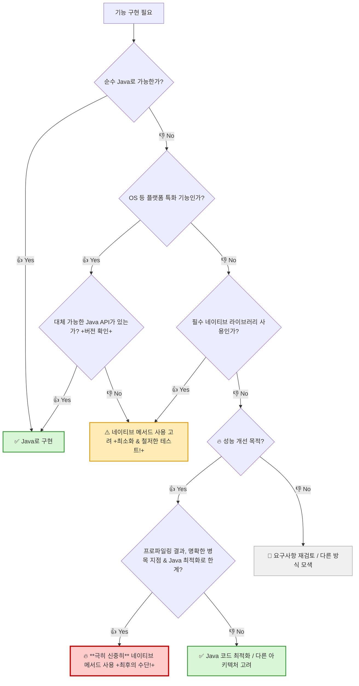

## 💡 네이티브 메서드는 신중히 사용하라

### 🤔 네이티브 메서드란?

- **정의**: C나 C++ 같은 네이티브 프로그래밍 언어(특정 하드웨어/OS에 맞춰 개발된 언어)로 작성된 메서드

- **호출**: 자바 코드에서는 **JNI(Java Native Interface)** 라는 기술을 통해 네이티브 메서드를 호출
  - _JNI는 자바와 다른 언어(주로 C/C++)를 연결하는 다리 역할_

### 🎯 네이티브 메서드의 주요 쓰임 (전통적)

1.  **💻 플랫폼 특화 기능 사용**:

    - OS 고유의 기능 (예: 윈도우 레지스트리 접근)

    - _레지스트리: 윈도우 시스템 설정, 하드웨어/소프트웨어 정보 등을 저장하는 데이터베이스._

2.  **📚 기존 네이티브 라이브러리 활용**:

    - 네이티브 언어로 작성된 기존 라이브러리(특히 레거시 시스템 관련) 재사용

3.  **🚀 성능 개선**:

    - 성능이 매우 중요한 특정 부분만 네이티브 언어로 작성하여 속도 향상 목적

### ✅ 네이티브 메서드 사용에 대한 현재 관점

1.  **💻 플랫폼 기능**:

    - **필요성 감소 👇**: 자바 표준 라이브러리가 발전 -> OS 같은 하부 플랫폼의 기능 점차 흡수중

      - **예시**: Java 9의 Process API는 OS 프로세스 접근 기능 제공 -> 네이티브 코드 필요성 감소

2.  **📚 기존 라이브러리 활용**:

    - **여전히 유효 ✅**: 대체 불가능한 중요한 네이티브 라이브러리

3.  **🚀 성능 개선**:

    - **거의 권장하지 않음 ❌**:

      - **JVM의 발전**: JVM 최적화 기술이 매우 발달 -> 대부분의 경우 자바만으로 충분한 성능

      - **호출 비용**: JNI 호출시 오버헤드(비용)

      - **개발/유지보수 어려움**: 복잡성 증가

      - **`BigInteger` 사례**: 초기에는 C 라이브러리에 의존, Java 3에서 순수 자바로 재구현된 후 속도 향상.

    - **예외적인 경우 ✨**:

      - 고도로 최적화된 특정 네이티브 라이브러리가 자바 구현보다 월등한 성능을 제공할 때 (매우 특수한 상황).

      - **예시**: **GMP**(GNU Multiple Precision Arithmetic Library) 같은 고성능 다중 정밀 연산 C 라이브러리.

        - _GMP: 매우 큰 정수 등의 정밀 계산에 특화된 라이브러리로, 특정 연산에서 `java.math.BigInteger`보다 빠름_

### ⚠️ 네이티브 메서드의 심각한 단점

1.  **💣 안전성 문제**:

    - 네이티브 언어는 메모리를 직접 관리

    - -> **메모리 훼손(corruption) 오류** 발생 시 자바 애플리케이션 전체 불안정화 or **종료 가능성**

    - 자바의 중요한 장점, **메모리 안전성** (예: 가비지 컬렉션) 손실

2.  **🔗 이식성 저하**:

    - 네이티브 코드는 특정 OS나 하드웨어 아키텍처에 종속될 가능성이 높아, 다른 환경에서 실행하기 어려움 (Write Once, Run Anywhere 원칙 훼손)

3.  **🐛 디버깅 어려움 & 성능 저하 가능성**:

    - 자바 코드와 네이티브 코드를 넘나드는 디버깅은 **매우 복잡하고 어려움**

    - 네이티브 메모리는 **GC가 관리/추적하지 못해** 메모리 누수 추적이 어려움 (Item 8 참고).

    - 자바 <-> 네이티브 코드 간의 **호출 비용(오버헤드)** 이 발생 -> 오히려 성능 저하 유발

4.  **🤯 개발 및 유지보수 어려움**:

    - 자바와 네이티브 코드를 연결하는 '접착 코드(glue code)' 작성 -> **번거롭고 가독성 저하**

    - 자바와 네이티브 언어 모두에 대한 **전문 지식**이 필요

### ➡️ 네이티브 메서드 사용 결정 흐름도

---

### ✨ 핵심 정리 ✨

> **네이티브 메서드 사용, 꼭 필요한지 다시 한번 생각해보세요!** 🤔

- 🚀 네이티브 메서드가 **성능을 개선하는 경우는 드뭅니다.** (JVM은 충분히 빠르다!)

- 🔧 **꼭 필요한 경우**(저수준 자원 접근, 대체 불가능한 라이브러리 사용)에만 **최소한으로 사용**하고, **매우 철저하게 테스트**하세요.

- 💣 네이티브 코드의 **단 하나의 버그**가 **애플리케이션 전체를 망가뜨릴 수 있습니다!**

---
